# Projects and dependencies analysis

This document provides a comprehensive overview of the projects and their dependencies in the context of upgrading to .NETCoreApp,Version=v10.0.

## Table of Contents

- [Executive Summary](#executive-Summary)
  - [Highlevel Metrics](#highlevel-metrics)
  - [Projects Compatibility](#projects-compatibility)
  - [Package Compatibility](#package-compatibility)
  - [API Compatibility](#api-compatibility)
  - [Binding Redirect Configuration](#binding-redirect-configuration)
- [Aggregate NuGet packages details](#aggregate-nuget-packages-details)
- [Top API Migration Challenges](#top-api-migration-challenges)
  - [Technologies and Features](#technologies-and-features)
  - [Most Frequent API Issues](#most-frequent-api-issues)
- [Projects Relationship Graph](#projects-relationship-graph)
- [Project Details](#project-details)

  - [E:\SJVS\Projects\Neo\src\Neo.Application\Neo.Application.csproj](#e:sjvsprojectsneosrcneoapplicationneoapplicationcsproj)
  - [E:\SJVS\Projects\Neo\src\Neo.Common\Neo.Common.csproj](#e:sjvsprojectsneosrcneocommonneocommoncsproj)
  - [E:\SJVS\Projects\Neo\src\Neo.Domain\Neo.Domain.csproj](#e:sjvsprojectsneosrcneodomainneodomaincsproj)
  - [E:\SJVS\Projects\Neo\src\Neo.Endpoint\Neo.Endpoint.csproj](#e:sjvsprojectsneosrcneoendpointneoendpointcsproj)
  - [E:\SJVS\Projects\Neo\src\Neo.Infrastructure\Neo.Infrastructure.csproj](#e:sjvsprojectsneosrcneoinfrastructureneoinfrastructurecsproj)
  - [E:\SJVS\Projects\Neo\tests\Neo.Application.Tests\Neo.Application.Tests.csproj](#e:sjvsprojectsneotestsneoapplicationtestsneoapplicationtestscsproj)
  - [E:\SJVS\Projects\Neo\tests\Neo.Common.Tests\Neo.Common.Tests.csproj](#e:sjvsprojectsneotestsneocommontestsneocommontestscsproj)
  - [E:\SJVS\Projects\Neo\tests\Neo.Domain.Tests\Neo.Domain.Tests.csproj](#e:sjvsprojectsneotestsneodomaintestsneodomaintestscsproj)
  - [E:\SJVS\Projects\Neo\tests\Neo.Infrastructure.IntegrationTests\Neo.Infrastructure.IntegrationTests.csproj](#e:sjvsprojectsneotestsneoinfrastructureintegrationtestsneoinfrastructureintegrationtestscsproj)
  - [E:\SJVS\Projects\Neo-Bpms\src\Neo.Bpms.Api\Neo.Bpms.Api.csproj](#e:sjvsprojectsneo-bpmssrcneobpmsapineobpmsapicsproj)
  - [E:\SJVS\Projects\Neo-Bpms\src\Neo.Bpms.Application\Neo.Bpms.Application.csproj](#e:sjvsprojectsneo-bpmssrcneobpmsapplicationneobpmsapplicationcsproj)
  - [E:\SJVS\Projects\Neo-Bpms\src\Neo.Bpms.Domain\Neo.Bpms.Domain.csproj](#e:sjvsprojectsneo-bpmssrcneobpmsdomainneobpmsdomaincsproj)
  - [E:\SJVS\Projects\Neo-Bpms\src\Neo.Bpms.Infrastructure\Neo.Bpms.Infrastructure.csproj](#e:sjvsprojectsneo-bpmssrcneobpmsinfrastructureneobpmsinfrastructurecsproj)
  - [E:\SJVS\Projects\Neo-Bpms\src\Neo.Bpms.UI.MVC\Neo.Bpms.UI.MVC.csproj](#e:sjvsprojectsneo-bpmssrcneobpmsuimvcneobpmsuimvccsproj)
  - [E:\SJVS\Projects\Neo-Bpms\src\Neo.Bpms.UI.Resources\Neo.Bpms.UI.Resources.csproj](#e:sjvsprojectsneo-bpmssrcneobpmsuiresourcesneobpmsuiresourcescsproj)
  - [E:\SJVS\Projects\Neo-Bpms\tests\Neo.Bpms.UI.MVC.Tests\Neo.Bpms.UI.MVC.Tests.csproj](#e:sjvsprojectsneo-bpmstestsneobpmsuimvctestsneobpmsuimvctestscsproj)
  - [src\AdminPanel\Club.AdminPanel.Domain\Club.AdminPanel.Domain.csproj](#srcadminpanelclubadminpaneldomainclubadminpaneldomaincsproj)
  - [src\AdminPanel\Club.AdminPanel.Web\Club.AdminPanel.Web.csproj](#srcadminpanelclubadminpanelwebclubadminpanelwebcsproj)
  - [src\Channel\Club.Channel.Api\Club.Channel.Api.csproj](#srcchannelclubchannelapiclubchannelapicsproj)
  - [src\Channel\Club.Channel.Application\Club.Channel.Application.csproj](#srcchannelclubchannelapplicationclubchannelapplicationcsproj)
  - [src\Core\Club.Application\Club.Application.csproj](#srccoreclubapplicationclubapplicationcsproj)
  - [src\Core\Club.Domain\Club.Domain.csproj](#srccoreclubdomainclubdomaincsproj)
  - [src\Core\Club.Infrastructure\Club.Infrastructure.csproj](#srccoreclubinfrastructureclubinfrastructurecsproj)
  - [src\CustomerPortal\Club.CustomerPortal.Api\Club.CustomerPortal.Api.csproj](#srccustomerportalclubcustomerportalapiclubcustomerportalapicsproj)
  - [src\CustomerPortal\Club.CustomerPortal.Application\Club.CustomerPortal.Application.csproj](#srccustomerportalclubcustomerportalapplicationclubcustomerportalapplicationcsproj)
  - [src\EventHandler\Club.EventHandler.Api\Club.EventHandler.Api.csproj](#srceventhandlerclubeventhandlerapiclubeventhandlerapicsproj)
  - [src\EventHandler\Club.EventHandler.Application\Club.EventHandler.Application.csproj](#srceventhandlerclubeventhandlerapplicationclubeventhandlerapplicationcsproj)
  - [src\PromotionJobWorker\Club.PromotionJobWorker.Api\Club.PromotionJobWorker.Api.csproj](#srcpromotionjobworkerclubpromotionjobworkerapiclubpromotionjobworkerapicsproj)
  - [src\PromotionJobWorker\Club.PromotionJobWorker.Application\Club.PromotionJobWorker.Application.csproj](#srcpromotionjobworkerclubpromotionjobworkerapplicationclubpromotionjobworkerapplicationcsproj)


## Executive Summary

### Highlevel Metrics

| Metric | Count | Status |
| :--- | :---: | :--- |
| Total Projects | 29 | 13 require upgrade |
| Total NuGet Packages | 115 | 21 need upgrade |
| Total Code Files | 2661 |  |
| Total Code Files with Incidents | 25 |  |
| Total Lines of Code | 240196 |  |
| Total Number of Issues | 94 |  |
| Estimated LOC to modify | 36+ | at least 0/0% of codebase |

### Projects Compatibility

| Project | Target Framework | Difficulty | Package Issues | API Issues | Binding Issues | Est. LOC Impact | Description |
| :--- | :---: | :---: | :---: | :---: | :---: | :---: | :--- |
| [E:\SJVS\Projects\Neo\src\Neo.Application\Neo.Application.csproj](#e:sjvsprojectsneosrcneoapplicationneoapplicationcsproj) | net10.0 | ✅ None | 0 | 0 | 0 |  | ClassLibrary, Sdk Style = True |
| [E:\SJVS\Projects\Neo\src\Neo.Common\Neo.Common.csproj](#e:sjvsprojectsneosrcneocommonneocommoncsproj) | net10.0 | ✅ None | 0 | 0 | 0 |  | ClassLibrary, Sdk Style = True |
| [E:\SJVS\Projects\Neo\src\Neo.Domain\Neo.Domain.csproj](#e:sjvsprojectsneosrcneodomainneodomaincsproj) | net10.0 | ✅ None | 0 | 0 | 0 |  | ClassLibrary, Sdk Style = True |
| [E:\SJVS\Projects\Neo\src\Neo.Endpoint\Neo.Endpoint.csproj](#e:sjvsprojectsneosrcneoendpointneoendpointcsproj) | net10.0 | ✅ None | 0 | 0 | 0 |  | ClassLibrary, Sdk Style = True |
| [E:\SJVS\Projects\Neo\src\Neo.Infrastructure\Neo.Infrastructure.csproj](#e:sjvsprojectsneosrcneoinfrastructureneoinfrastructurecsproj) | net10.0 | ✅ None | 0 | 0 | 0 |  | ClassLibrary, Sdk Style = True |
| [E:\SJVS\Projects\Neo\tests\Neo.Application.Tests\Neo.Application.Tests.csproj](#e:sjvsprojectsneotestsneoapplicationtestsneoapplicationtestscsproj) | net10.0 | ✅ None | 0 | 0 | 0 |  | ClassLibrary, Sdk Style = True |
| [E:\SJVS\Projects\Neo\tests\Neo.Common.Tests\Neo.Common.Tests.csproj](#e:sjvsprojectsneotestsneocommontestsneocommontestscsproj) | net10.0 | ✅ None | 0 | 0 | 0 |  | ClassLibrary, Sdk Style = True |
| [E:\SJVS\Projects\Neo\tests\Neo.Domain.Tests\Neo.Domain.Tests.csproj](#e:sjvsprojectsneotestsneodomaintestsneodomaintestscsproj) | net10.0 | ✅ None | 0 | 0 | 0 |  | ClassLibrary, Sdk Style = True |
| [E:\SJVS\Projects\Neo\tests\Neo.Infrastructure.IntegrationTests\Neo.Infrastructure.IntegrationTests.csproj](#e:sjvsprojectsneotestsneoinfrastructureintegrationtestsneoinfrastructureintegrationtestscsproj) | net10.0 | ✅ None | 0 | 0 | 0 |  | ClassLibrary, Sdk Style = True |
| [E:\SJVS\Projects\Neo-Bpms\src\Neo.Bpms.Api\Neo.Bpms.Api.csproj](#e:sjvsprojectsneo-bpmssrcneobpmsapineobpmsapicsproj) | net10.0 | ✅ None | 0 | 0 | 0 |  | ClassLibrary, Sdk Style = True |
| [E:\SJVS\Projects\Neo-Bpms\src\Neo.Bpms.Application\Neo.Bpms.Application.csproj](#e:sjvsprojectsneo-bpmssrcneobpmsapplicationneobpmsapplicationcsproj) | net10.0 | ✅ None | 0 | 0 | 0 |  | ClassLibrary, Sdk Style = True |
| [E:\SJVS\Projects\Neo-Bpms\src\Neo.Bpms.Domain\Neo.Bpms.Domain.csproj](#e:sjvsprojectsneo-bpmssrcneobpmsdomainneobpmsdomaincsproj) | net10.0 | ✅ None | 0 | 0 | 0 |  | ClassLibrary, Sdk Style = True |
| [E:\SJVS\Projects\Neo-Bpms\src\Neo.Bpms.Infrastructure\Neo.Bpms.Infrastructure.csproj](#e:sjvsprojectsneo-bpmssrcneobpmsinfrastructureneobpmsinfrastructurecsproj) | net10.0 | ✅ None | 0 | 0 | 0 |  | ClassLibrary, Sdk Style = True |
| [E:\SJVS\Projects\Neo-Bpms\src\Neo.Bpms.UI.MVC\Neo.Bpms.UI.MVC.csproj](#e:sjvsprojectsneo-bpmssrcneobpmsuimvcneobpmsuimvccsproj) | net10.0 | ✅ None | 0 | 0 | 0 |  | ClassLibrary, Sdk Style = True |
| [E:\SJVS\Projects\Neo-Bpms\src\Neo.Bpms.UI.Resources\Neo.Bpms.UI.Resources.csproj](#e:sjvsprojectsneo-bpmssrcneobpmsuiresourcesneobpmsuiresourcescsproj) | net10.0 | ✅ None | 0 | 0 | 0 |  | ClassLibrary, Sdk Style = True |
| [E:\SJVS\Projects\Neo-Bpms\tests\Neo.Bpms.UI.MVC.Tests\Neo.Bpms.UI.MVC.Tests.csproj](#e:sjvsprojectsneo-bpmstestsneobpmsuimvctestsneobpmsuimvctestscsproj) | net10.0 | ✅ None | 0 | 0 | 0 |  | ClassLibrary, Sdk Style = True |
| [src\AdminPanel\Club.AdminPanel.Domain\Club.AdminPanel.Domain.csproj](#srcadminpanelclubadminpaneldomainclubadminpaneldomaincsproj) | net10.0 | 🟢 Low | 0 | 0 | 0 |  | ClassLibrary, Sdk Style = True |
| [src\AdminPanel\Club.AdminPanel.Web\Club.AdminPanel.Web.csproj](#srcadminpanelclubadminpanelwebclubadminpanelwebcsproj) | net10.0 | 🟢 Low | 16 | 17 | 0 | 17+ | AspNetCore, Sdk Style = True |
| [src\Channel\Club.Channel.Api\Club.Channel.Api.csproj](#srcchannelclubchannelapiclubchannelapicsproj) | net10.0 | 🟢 Low | 5 | 6 | 0 | 6+ | AspNetCore, Sdk Style = True |
| [src\Channel\Club.Channel.Application\Club.Channel.Application.csproj](#srcchannelclubchannelapplicationclubchannelapplicationcsproj) | net10.0 | 🟢 Low | 2 | 0 | 0 |  | ClassLibrary, Sdk Style = True |
| [src\Core\Club.Application\Club.Application.csproj](#srccoreclubapplicationclubapplicationcsproj) | net10.0 | 🟢 Low | 2 | 0 | 0 |  | ClassLibrary, Sdk Style = True |
| [src\Core\Club.Domain\Club.Domain.csproj](#srccoreclubdomainclubdomaincsproj) | net10.0 | 🟢 Low | 3 | 0 | 0 |  | ClassLibrary, Sdk Style = True |
| [src\Core\Club.Infrastructure\Club.Infrastructure.csproj](#srccoreclubinfrastructureclubinfrastructurecsproj) | net10.0 | 🟢 Low | 8 | 4 | 0 | 4+ | ClassLibrary, Sdk Style = True |
| [src\CustomerPortal\Club.CustomerPortal.Api\Club.CustomerPortal.Api.csproj](#srccustomerportalclubcustomerportalapiclubcustomerportalapicsproj) | net10.0 | 🟢 Low | 5 | 5 | 0 | 5+ | AspNetCore, Sdk Style = True |
| [src\CustomerPortal\Club.CustomerPortal.Application\Club.CustomerPortal.Application.csproj](#srccustomerportalclubcustomerportalapplicationclubcustomerportalapplicationcsproj) | net10.0 | 🟢 Low | 2 | 4 | 0 | 4+ | ClassLibrary, Sdk Style = True |
| [src\EventHandler\Club.EventHandler.Api\Club.EventHandler.Api.csproj](#srceventhandlerclubeventhandlerapiclubeventhandlerapicsproj) | net10.0 | 🟢 Low | 1 | 0 | 0 |  | AspNetCore, Sdk Style = True |
| [src\EventHandler\Club.EventHandler.Application\Club.EventHandler.Application.csproj](#srceventhandlerclubeventhandlerapplicationclubeventhandlerapplicationcsproj) | net10.0 | 🟢 Low | 0 | 0 | 0 |  | ClassLibrary, Sdk Style = True |
| [src\PromotionJobWorker\Club.PromotionJobWorker.Api\Club.PromotionJobWorker.Api.csproj](#srcpromotionjobworkerclubpromotionjobworkerapiclubpromotionjobworkerapicsproj) | net10.0 | 🟢 Low | 1 | 0 | 0 |  | AspNetCore, Sdk Style = True |
| [src\PromotionJobWorker\Club.PromotionJobWorker.Application\Club.PromotionJobWorker.Application.csproj](#srcpromotionjobworkerclubpromotionjobworkerapplicationclubpromotionjobworkerapplicationcsproj) | net10.0 | 🟢 Low | 0 | 0 | 0 |  | ClassLibrary, Sdk Style = True |

### Package Compatibility

| Status | Count | Percentage |
| :--- | :---: | :---: |
| ✅ Compatible | 94 | 81/7% |
| ⚠️ Incompatible | 3 | 2/6% |
| 🔄 Upgrade Recommended | 18 | 15/7% |
| ***Total NuGet Packages*** | ***115*** | ***100%*** |

### API Compatibility

| Category | Count | Impact |
| :--- | :---: | :--- |
| 🔴 Binary Incompatible | 17 | High - Require code changes |
| 🟡 Source Incompatible | 11 | Medium - Needs re-compilation and potential conflicting API error fixing |
| 🔵 Behavioral change | 8 | Low - Behavioral changes that may require testing at runtime |
| ✅ Compatible | 15609 |  |
| ***Total APIs Analyzed*** | ***15645*** |  |

## Aggregate NuGet packages details

| Package | Current Version | Suggested Version | Projects | Description |
| :--- | :---: | :---: | :--- | :--- |
| Ardalis.GuardClauses | 5.0.0 |  | [Club.AdminPanel.Web.csproj](#srcadminpanelclubadminpanelwebclubadminpanelwebcsproj)<br/>[Club.Application.csproj](#srccoreclubapplicationclubapplicationcsproj)<br/>[Club.Channel.Application.csproj](#srcchannelclubchannelapplicationclubchannelapplicationcsproj)<br/>[Club.CustomerPortal.Application.csproj](#srccustomerportalclubcustomerportalapplicationclubcustomerportalapplicationcsproj)<br/>[Neo.Application.csproj](#e:sjvsprojectsneosrcneoapplicationneoapplicationcsproj)<br/>[Neo.Bpms.Infrastructure.csproj](#e:sjvsprojectsneo-bpmssrcneobpmsinfrastructureneobpmsinfrastructurecsproj)<br/>[Neo.Bpms.UI.MVC.csproj](#e:sjvsprojectsneo-bpmssrcneobpmsuimvcneobpmsuimvccsproj) | ✅Compatible |
| Asp.Versioning.Mvc | 10.0.0 |  | [Neo.Bpms.UI.MVC.csproj](#e:sjvsprojectsneo-bpmssrcneobpmsuimvcneobpmsuimvccsproj)<br/>[Neo.Endpoint.csproj](#e:sjvsprojectsneosrcneoendpointneoendpointcsproj) | ✅Compatible |
| Asp.Versioning.Mvc.ApiExplorer | 10.0.0 |  | [Neo.Endpoint.csproj](#e:sjvsprojectsneosrcneoendpointneoendpointcsproj) | ✅Compatible |
| AutoMapper | 14.0.0 | 16.2.0 | [Club.AdminPanel.Web.csproj](#srcadminpanelclubadminpanelwebclubadminpanelwebcsproj)<br/>[Club.Application.csproj](#srccoreclubapplicationclubapplicationcsproj)<br/>[Club.Channel.Application.csproj](#srcchannelclubchannelapplicationclubchannelapplicationcsproj)<br/>[Club.CustomerPortal.Application.csproj](#srccustomerportalclubcustomerportalapplicationclubcustomerportalapplicationcsproj) | NuGet package contains security vulnerability |
| Captcha | 4.4.2 |  | [Neo.Bpms.UI.MVC.csproj](#e:sjvsprojectsneo-bpmssrcneobpmsuimvcneobpmsuimvccsproj) | ✅Compatible |
| Castle.Core | 5.2.1 |  | [Neo.Domain.csproj](#e:sjvsprojectsneosrcneodomainneodomaincsproj) | ✅Compatible |
| CoreCLR-NCalc | 3.1.253 |  | [Club.Domain.csproj](#srccoreclubdomainclubdomaincsproj) | ⚠️NuGet package is deprecated |
| coverlet.collector | 10.0.0 |  | [Neo.Application.Tests.csproj](#e:sjvsprojectsneotestsneoapplicationtestsneoapplicationtestscsproj)<br/>[Neo.Bpms.UI.MVC.Tests.csproj](#e:sjvsprojectsneo-bpmstestsneobpmsuimvctestsneobpmsuimvctestscsproj)<br/>[Neo.Common.Tests.csproj](#e:sjvsprojectsneotestsneocommontestsneocommontestscsproj)<br/>[Neo.Domain.Tests.csproj](#e:sjvsprojectsneotestsneodomaintestsneodomaintestscsproj)<br/>[Neo.Infrastructure.IntegrationTests.csproj](#e:sjvsprojectsneotestsneoinfrastructureintegrationtestsneoinfrastructureintegrationtestscsproj) | ✅Compatible |
| DNTPersianUtils.Core | 6.6.0 |  | [Club.AdminPanel.Web.csproj](#srcadminpanelclubadminpanelwebclubadminpanelwebcsproj) | ✅Compatible |
| DNTPersianUtils.Core | 6.9.0 |  | [Neo.Bpms.UI.MVC.csproj](#e:sjvsprojectsneo-bpmssrcneobpmsuimvcneobpmsuimvccsproj)<br/>[Neo.Infrastructure.csproj](#e:sjvsprojectsneosrcneoinfrastructureneoinfrastructurecsproj) | ✅Compatible |
| Elastic.OpenTelemetry | 1.1.0 |  | [Club.Infrastructure.csproj](#srccoreclubinfrastructureclubinfrastructurecsproj) | ✅Compatible |
| EPPlus | 8.0.1 |  | [Neo.Bpms.Api.csproj](#e:sjvsprojectsneo-bpmssrcneobpmsapineobpmsapicsproj)<br/>[Neo.Bpms.Infrastructure.csproj](#e:sjvsprojectsneo-bpmssrcneobpmsinfrastructureneobpmsinfrastructurecsproj)<br/>[Neo.Bpms.UI.MVC.csproj](#e:sjvsprojectsneo-bpmssrcneobpmsuimvcneobpmsuimvccsproj) | ✅Compatible |
| FluentAssertions | 8.10.0 |  | [Neo.Application.Tests.csproj](#e:sjvsprojectsneotestsneoapplicationtestsneoapplicationtestscsproj)<br/>[Neo.Bpms.UI.MVC.Tests.csproj](#e:sjvsprojectsneo-bpmstestsneobpmsuimvctestsneobpmsuimvctestscsproj)<br/>[Neo.Common.Tests.csproj](#e:sjvsprojectsneotestsneocommontestsneocommontestscsproj)<br/>[Neo.Domain.Tests.csproj](#e:sjvsprojectsneotestsneodomaintestsneodomaintestscsproj)<br/>[Neo.Infrastructure.IntegrationTests.csproj](#e:sjvsprojectsneotestsneoinfrastructureintegrationtestsneoinfrastructureintegrationtestscsproj) | ✅Compatible |
| FluentValidation.AspNetCore | 11.3.0 |  | [Club.Channel.Api.csproj](#srcchannelclubchannelapiclubchannelapicsproj)<br/>[Club.CustomerPortal.Api.csproj](#srccustomerportalclubcustomerportalapiclubcustomerportalapicsproj) | ⚠️NuGet package is deprecated |
| FluentValidation.DependencyInjectionExtensions | 11.11.0 |  | [Club.AdminPanel.Web.csproj](#srcadminpanelclubadminpanelwebclubadminpanelwebcsproj)<br/>[Club.Application.csproj](#srccoreclubapplicationclubapplicationcsproj)<br/>[Club.Channel.Application.csproj](#srcchannelclubchannelapplicationclubchannelapplicationcsproj)<br/>[Club.CustomerPortal.Application.csproj](#srccustomerportalclubcustomerportalapplicationclubcustomerportalapplicationcsproj) | ✅Compatible |
| FluentValidation.DependencyInjectionExtensions | 12.1.1 |  | [Neo.Application.csproj](#e:sjvsprojectsneosrcneoapplicationneoapplicationcsproj) | ✅Compatible |
| Hangfire | 1.8.23 |  | [Neo.Infrastructure.csproj](#e:sjvsprojectsneosrcneoinfrastructureneoinfrastructurecsproj) | ✅Compatible |
| Hangfire.Core | 1.8.23 |  | [Neo.Infrastructure.csproj](#e:sjvsprojectsneosrcneoinfrastructureneoinfrastructurecsproj) | ✅Compatible |
| Hangfire.Redis | 2.0.1 |  | [Neo.Infrastructure.csproj](#e:sjvsprojectsneosrcneoinfrastructureneoinfrastructurecsproj) | ✅Compatible |
| Hangfire.Redis.StackExchange | 1.12.0 |  | [Neo.Infrastructure.csproj](#e:sjvsprojectsneosrcneoinfrastructureneoinfrastructurecsproj) | ✅Compatible |
| Hangfire.SqlServer | 1.8.23 |  | [Neo.Infrastructure.csproj](#e:sjvsprojectsneosrcneoinfrastructureneoinfrastructurecsproj) | ✅Compatible |
| Mapster | 10.0.7 |  | [Neo.Application.csproj](#e:sjvsprojectsneosrcneoapplicationneoapplicationcsproj) | ✅Compatible |
| Mapster | 7.4.0 |  | [Club.AdminPanel.Web.csproj](#srcadminpanelclubadminpanelwebclubadminpanelwebcsproj)<br/>[Club.Application.csproj](#srccoreclubapplicationclubapplicationcsproj)<br/>[Club.Channel.Api.csproj](#srcchannelclubchannelapiclubchannelapicsproj)<br/>[Club.Channel.Application.csproj](#srcchannelclubchannelapplicationclubchannelapplicationcsproj)<br/>[Club.CustomerPortal.Api.csproj](#srccustomerportalclubcustomerportalapiclubcustomerportalapicsproj)<br/>[Club.CustomerPortal.Application.csproj](#srccustomerportalclubcustomerportalapplicationclubcustomerportalapplicationcsproj)<br/>[Club.Domain.csproj](#srccoreclubdomainclubdomaincsproj) | ✅Compatible |
| Markdig | 0.42.0 |  | [Neo.Bpms.UI.MVC.csproj](#e:sjvsprojectsneo-bpmssrcneobpmsuimvcneobpmsuimvccsproj) | ✅Compatible |
| MassTransit | 8.4.1 |  | [Club.AdminPanel.Web.csproj](#srcadminpanelclubadminpanelwebclubadminpanelwebcsproj)<br/>[Club.Application.csproj](#srccoreclubapplicationclubapplicationcsproj)<br/>[Club.Infrastructure.csproj](#srccoreclubinfrastructureclubinfrastructurecsproj) | ✅Compatible |
| MassTransit.Quartz | 8.4.1 |  | [Club.Infrastructure.csproj](#srccoreclubinfrastructureclubinfrastructurecsproj) | ✅Compatible |
| MassTransit.RabbitMQ | 8.4.1 |  | [Club.AdminPanel.Web.csproj](#srcadminpanelclubadminpanelwebclubadminpanelwebcsproj)<br/>[Club.Infrastructure.csproj](#srccoreclubinfrastructureclubinfrastructurecsproj) | ✅Compatible |
| MediatR | 12.5.0 |  | [Club.AdminPanel.Web.csproj](#srcadminpanelclubadminpanelwebclubadminpanelwebcsproj)<br/>[Club.Domain.csproj](#srccoreclubdomainclubdomaincsproj) | ✅Compatible |
| MediatR | 14.1.0 |  | [Neo.Bpms.Infrastructure.csproj](#e:sjvsprojectsneo-bpmssrcneobpmsinfrastructureneobpmsinfrastructurecsproj)<br/>[Neo.Bpms.UI.MVC.csproj](#e:sjvsprojectsneo-bpmssrcneobpmsuimvcneobpmsuimvccsproj)<br/>[Neo.Domain.csproj](#e:sjvsprojectsneosrcneodomainneodomaincsproj) | ✅Compatible |
| Microsoft.AspNetCore.Authentication.JwtBearer | 10.0.8 |  | [Neo.Bpms.UI.MVC.csproj](#e:sjvsprojectsneo-bpmssrcneobpmsuimvcneobpmsuimvccsproj)<br/>[Neo.Infrastructure.csproj](#e:sjvsprojectsneosrcneoinfrastructureneoinfrastructurecsproj) | ✅Compatible |
| Microsoft.AspNetCore.Authentication.JwtBearer | 8.0.15 | 10.0.10 | [Club.AdminPanel.Web.csproj](#srcadminpanelclubadminpanelwebclubadminpanelwebcsproj) | NuGet package upgrade is recommended |
| Microsoft.AspNetCore.Diagnostics.EntityFrameworkCore | 8.0.15 | 10.0.10 | [Club.AdminPanel.Web.csproj](#srcadminpanelclubadminpanelwebclubadminpanelwebcsproj)<br/>[Club.Channel.Api.csproj](#srcchannelclubchannelapiclubchannelapicsproj)<br/>[Club.CustomerPortal.Api.csproj](#srccustomerportalclubcustomerportalapiclubcustomerportalapicsproj)<br/>[Club.Infrastructure.csproj](#srccoreclubinfrastructureclubinfrastructurecsproj) | NuGet package upgrade is recommended |
| Microsoft.AspNetCore.Html.Abstractions | 2.3.10 |  | [Neo.Bpms.Infrastructure.csproj](#e:sjvsprojectsneo-bpmssrcneobpmsinfrastructureneobpmsinfrastructurecsproj) | ✅Compatible |
| Microsoft.AspNetCore.Http.Abstractions | 2.3.10 |  | [Neo.Bpms.Infrastructure.csproj](#e:sjvsprojectsneo-bpmssrcneobpmsinfrastructureneobpmsinfrastructurecsproj) | ✅Compatible |
| Microsoft.AspNetCore.Mvc.NewtonsoftJson | 10.0.0 |  | [Neo.Bpms.UI.MVC.csproj](#e:sjvsprojectsneo-bpmssrcneobpmsuimvcneobpmsuimvccsproj) | ✅Compatible |
| Microsoft.AspNetCore.Mvc.Razor.RuntimeCompilation | 10.0.8 |  | [Neo.Endpoint.csproj](#e:sjvsprojectsneosrcneoendpointneoendpointcsproj) | ✅Compatible |
| Microsoft.AspNetCore.Mvc.Testing | 10.0.8 |  | [Neo.Infrastructure.IntegrationTests.csproj](#e:sjvsprojectsneotestsneoinfrastructureintegrationtestsneoinfrastructureintegrationtestscsproj) | ✅Compatible |
| Microsoft.AspNetCore.OpenApi | 8.0.8 | 10.0.10 | [Club.AdminPanel.Web.csproj](#srcadminpanelclubadminpanelwebclubadminpanelwebcsproj)<br/>[Club.Channel.Api.csproj](#srcchannelclubchannelapiclubchannelapicsproj)<br/>[Club.CustomerPortal.Api.csproj](#srccustomerportalclubcustomerportalapiclubcustomerportalapicsproj)<br/>[Club.EventHandler.Api.csproj](#srceventhandlerclubeventhandlerapiclubeventhandlerapicsproj)<br/>[Club.PromotionJobWorker.Api.csproj](#srcpromotionjobworkerclubpromotionjobworkerapiclubpromotionjobworkerapicsproj) | NuGet package upgrade is recommended |
| Microsoft.AspNetCore.SignalR.Common | 10.0.0 |  | [Neo.Bpms.Api.csproj](#e:sjvsprojectsneo-bpmssrcneobpmsapineobpmsapicsproj) | ✅Compatible |
| Microsoft.Data.Sqlite | 10.0.8 |  | [Neo.Bpms.Api.csproj](#e:sjvsprojectsneo-bpmssrcneobpmsapineobpmsapicsproj)<br/>[Neo.Bpms.UI.MVC.Tests.csproj](#e:sjvsprojectsneo-bpmstestsneobpmsuimvctestsneobpmsuimvctestscsproj) | ✅Compatible |
| Microsoft.EntityFrameworkCore | 10.0.8 |  | [Neo.Bpms.Infrastructure.csproj](#e:sjvsprojectsneo-bpmssrcneobpmsinfrastructureneobpmsinfrastructurecsproj) | ✅Compatible |
| Microsoft.EntityFrameworkCore | 8.0.15 | 10.0.10 | [Club.AdminPanel.Web.csproj](#srcadminpanelclubadminpanelwebclubadminpanelwebcsproj)<br/>[Club.Application.csproj](#srccoreclubapplicationclubapplicationcsproj)<br/>[Club.Channel.Application.csproj](#srcchannelclubchannelapplicationclubchannelapplicationcsproj)<br/>[Club.CustomerPortal.Application.csproj](#srccustomerportalclubcustomerportalapplicationclubcustomerportalapplicationcsproj) | NuGet package upgrade is recommended |
| Microsoft.EntityFrameworkCore.InMemory | 10.0.8 |  | [Neo.Infrastructure.IntegrationTests.csproj](#e:sjvsprojectsneotestsneoinfrastructureintegrationtestsneoinfrastructureintegrationtestscsproj) | ✅Compatible |
| Microsoft.EntityFrameworkCore.Relational | 8.0.15 | 10.0.10 | [Club.AdminPanel.Web.csproj](#srcadminpanelclubadminpanelwebclubadminpanelwebcsproj) | NuGet package upgrade is recommended |
| Microsoft.EntityFrameworkCore.SqlServer | 10.0.8 |  | [Neo.Bpms.Infrastructure.csproj](#e:sjvsprojectsneo-bpmssrcneobpmsinfrastructureneobpmsinfrastructurecsproj)<br/>[Neo.Infrastructure.csproj](#e:sjvsprojectsneosrcneoinfrastructureneoinfrastructurecsproj) | ✅Compatible |
| Microsoft.EntityFrameworkCore.SqlServer | 8.0.15 | 10.0.10 | [Club.AdminPanel.Web.csproj](#srcadminpanelclubadminpanelwebclubadminpanelwebcsproj)<br/>[Club.Infrastructure.csproj](#srccoreclubinfrastructureclubinfrastructurecsproj) | NuGet package upgrade is recommended |
| Microsoft.EntityFrameworkCore.Tools | 10.0.8 |  | [Neo.Domain.csproj](#e:sjvsprojectsneosrcneodomainneodomaincsproj)<br/>[Neo.Infrastructure.csproj](#e:sjvsprojectsneosrcneoinfrastructureneoinfrastructurecsproj) | ✅Compatible |
| Microsoft.EntityFrameworkCore.Tools | 8.0.15 | 10.0.10 | [Club.AdminPanel.Web.csproj](#srcadminpanelclubadminpanelwebclubadminpanelwebcsproj)<br/>[Club.Infrastructure.csproj](#srccoreclubinfrastructureclubinfrastructurecsproj) | NuGet package upgrade is recommended |
| Microsoft.Extensions.Caching.Abstractions | 8.0.0 | 10.0.10 | [Club.AdminPanel.Web.csproj](#srcadminpanelclubadminpanelwebclubadminpanelwebcsproj)<br/>[Club.Domain.csproj](#srccoreclubdomainclubdomaincsproj) | NuGet package upgrade is recommended |
| Microsoft.Extensions.Caching.Memory | 8.0.1 | 10.0.10 | [Club.AdminPanel.Web.csproj](#srcadminpanelclubadminpanelwebclubadminpanelwebcsproj)<br/>[Club.Domain.csproj](#srccoreclubdomainclubdomaincsproj) | NuGet package upgrade is recommended |
| Microsoft.Extensions.Caching.StackExchangeRedis | 10.0.8 |  | [Neo.Infrastructure.csproj](#e:sjvsprojectsneosrcneoinfrastructureneoinfrastructurecsproj) | ✅Compatible |
| Microsoft.Extensions.Caching.StackExchangeRedis | 8.0.15 | 10.0.10 | [Club.AdminPanel.Web.csproj](#srcadminpanelclubadminpanelwebclubadminpanelwebcsproj)<br/>[Club.Infrastructure.csproj](#srccoreclubinfrastructureclubinfrastructurecsproj) | NuGet package upgrade is recommended |
| Microsoft.Extensions.Configuration.Abstractions | 10.0.0 |  | [Neo.Bpms.Domain.csproj](#e:sjvsprojectsneo-bpmssrcneobpmsdomainneobpmsdomaincsproj) | ✅Compatible |
| Microsoft.Extensions.DependencyInjection.Abstractions | 10.0.0 |  | [Neo.Bpms.Domain.csproj](#e:sjvsprojectsneo-bpmssrcneobpmsdomainneobpmsdomaincsproj) | ✅Compatible |
| Microsoft.Extensions.Diagnostics.HealthChecks.EntityFrameworkCore | 8.0.8 | 10.0.10 | [Club.Channel.Api.csproj](#srcchannelclubchannelapiclubchannelapicsproj)<br/>[Club.CustomerPortal.Api.csproj](#srccustomerportalclubcustomerportalapiclubcustomerportalapicsproj) | NuGet package upgrade is recommended |
| Microsoft.Extensions.Logging.Abstractions | 10.0.0 |  | [Neo.Bpms.Domain.csproj](#e:sjvsprojectsneo-bpmssrcneobpmsdomainneobpmsdomaincsproj) | ✅Compatible |
| Microsoft.NET.Test.Sdk | 18.5.1 |  | [Neo.Application.Tests.csproj](#e:sjvsprojectsneotestsneoapplicationtestsneoapplicationtestscsproj)<br/>[Neo.Bpms.UI.MVC.Tests.csproj](#e:sjvsprojectsneo-bpmstestsneobpmsuimvctestsneobpmsuimvctestscsproj)<br/>[Neo.Common.Tests.csproj](#e:sjvsprojectsneotestsneocommontestsneocommontestscsproj)<br/>[Neo.Domain.Tests.csproj](#e:sjvsprojectsneotestsneodomaintestsneodomaintestscsproj)<br/>[Neo.Infrastructure.IntegrationTests.csproj](#e:sjvsprojectsneotestsneoinfrastructureintegrationtestsneoinfrastructureintegrationtestscsproj) | ✅Compatible |
| Microsoft.OpenApi | 1.6.22 |  | [Neo.Bpms.Infrastructure.csproj](#e:sjvsprojectsneo-bpmssrcneobpmsinfrastructureneobpmsinfrastructurecsproj)<br/>[Neo.Bpms.UI.MVC.csproj](#e:sjvsprojectsneo-bpmssrcneobpmsuimvcneobpmsuimvccsproj) | ✅Compatible |
| Microsoft.SourceLink.GitHub | 10.0.300 |  | [Neo.Application.csproj](#e:sjvsprojectsneosrcneoapplicationneoapplicationcsproj)<br/>[Neo.Application.Tests.csproj](#e:sjvsprojectsneotestsneoapplicationtestsneoapplicationtestscsproj)<br/>[Neo.Common.csproj](#e:sjvsprojectsneosrcneocommonneocommoncsproj)<br/>[Neo.Common.Tests.csproj](#e:sjvsprojectsneotestsneocommontestsneocommontestscsproj)<br/>[Neo.Domain.csproj](#e:sjvsprojectsneosrcneodomainneodomaincsproj)<br/>[Neo.Domain.Tests.csproj](#e:sjvsprojectsneotestsneodomaintestsneodomaintestscsproj)<br/>[Neo.Endpoint.csproj](#e:sjvsprojectsneosrcneoendpointneoendpointcsproj)<br/>[Neo.Infrastructure.csproj](#e:sjvsprojectsneosrcneoinfrastructureneoinfrastructurecsproj)<br/>[Neo.Infrastructure.IntegrationTests.csproj](#e:sjvsprojectsneotestsneoinfrastructureintegrationtestsneoinfrastructureintegrationtestscsproj) | ✅Compatible |
| Microsoft.SqlServer.SqlManagementObjects | 172.64.0 |  | [Club.AdminPanel.Web.csproj](#srcadminpanelclubadminpanelwebclubadminpanelwebcsproj)<br/>[Neo.Bpms.Infrastructure.csproj](#e:sjvsprojectsneo-bpmssrcneobpmsinfrastructureneobpmsinfrastructurecsproj) | ✅Compatible |
| Microsoft.VisualStudio.Azure.Containers.Tools.Targets | 1.21.0 |  | [Club.AdminPanel.Web.csproj](#srcadminpanelclubadminpanelwebclubadminpanelwebcsproj)<br/>[Club.Channel.Api.csproj](#srcchannelclubchannelapiclubchannelapicsproj)<br/>[Club.CustomerPortal.Api.csproj](#srccustomerportalclubcustomerportalapiclubcustomerportalapicsproj) | ⚠️NuGet package is incompatible |
| Minio | 6.0.5 |  | [Club.AdminPanel.Web.csproj](#srcadminpanelclubadminpanelwebclubadminpanelwebcsproj) | ✅Compatible |
| Minio | 7.0.0 |  | [Neo.Infrastructure.csproj](#e:sjvsprojectsneosrcneoinfrastructureneoinfrastructurecsproj) | ✅Compatible |
| MinVer | 5.0.0 |  | [Neo.Bpms.Api.csproj](#e:sjvsprojectsneo-bpmssrcneobpmsapineobpmsapicsproj) | ✅Compatible |
| MongoDB.Driver | 3.8.1 |  | [Neo.Infrastructure.csproj](#e:sjvsprojectsneosrcneoinfrastructureneoinfrastructurecsproj) | ✅Compatible |
| Moq | 4.20.72 |  | [Neo.Bpms.UI.MVC.Tests.csproj](#e:sjvsprojectsneo-bpmstestsneobpmsuimvctestsneobpmsuimvctestscsproj)<br/>[Neo.Infrastructure.IntegrationTests.csproj](#e:sjvsprojectsneotestsneoinfrastructureintegrationtestsneoinfrastructureintegrationtestscsproj) | ✅Compatible |
| NSwag.AspNetCore | 14.2.0 |  | [Club.Channel.Api.csproj](#srcchannelclubchannelapiclubchannelapicsproj)<br/>[Club.CustomerPortal.Api.csproj](#srccustomerportalclubcustomerportalapiclubcustomerportalapicsproj) | ✅Compatible |
| NSwag.AspNetCore | 14.7.1 |  | [Neo.Endpoint.csproj](#e:sjvsprojectsneosrcneoendpointneoendpointcsproj) | ✅Compatible |
| NSwag.MSBuild | 14.2.0 |  | [Club.Channel.Api.csproj](#srcchannelclubchannelapiclubchannelapicsproj)<br/>[Club.CustomerPortal.Api.csproj](#srccustomerportalclubcustomerportalapiclubcustomerportalapicsproj) | ✅Compatible |
| NSwag.MSBuild | 14.7.1 |  | [Neo.Endpoint.csproj](#e:sjvsprojectsneosrcneoendpointneoendpointcsproj) | ✅Compatible |
| NWebsec.AspNetCore.Middleware | 3.0.0 |  | [Neo.Bpms.UI.MVC.csproj](#e:sjvsprojectsneo-bpmssrcneobpmsuimvcneobpmsuimvccsproj) | ✅Compatible |
| OpenTelemetry.Api.ProviderBuilderExtensions | 1.12.0 |  | [Club.Infrastructure.csproj](#srccoreclubinfrastructureclubinfrastructurecsproj) | ✅Compatible |
| OpenTelemetry.Exporter.Console | 1.12.0 |  | [Club.Infrastructure.csproj](#srccoreclubinfrastructureclubinfrastructurecsproj) | ✅Compatible |
| OpenTelemetry.Exporter.Console | 1.15.3 |  | [Neo.Infrastructure.csproj](#e:sjvsprojectsneosrcneoinfrastructureneoinfrastructurecsproj) | ✅Compatible |
| OpenTelemetry.Exporter.Jaeger | 1.5.1 | 1.5.1 | [Club.Infrastructure.csproj](#srccoreclubinfrastructureclubinfrastructurecsproj) | NuGet package contains security vulnerability |
| OpenTelemetry.Exporter.OpenTelemetryProtocol | 1.15.3 |  | [Neo.Infrastructure.csproj](#e:sjvsprojectsneosrcneoinfrastructureneoinfrastructurecsproj) | ✅Compatible |
| OpenTelemetry.Exporter.Zipkin | 1.12.0 | 1.17.0 | [Club.Infrastructure.csproj](#srccoreclubinfrastructureclubinfrastructurecsproj) | NuGet package contains security vulnerability |
| OpenTelemetry.Extensions.Hosting | 1.12.0 |  | [Club.Infrastructure.csproj](#srccoreclubinfrastructureclubinfrastructurecsproj) | ✅Compatible |
| OpenTelemetry.Extensions.Hosting | 1.15.3 |  | [Neo.Infrastructure.csproj](#e:sjvsprojectsneosrcneoinfrastructureneoinfrastructurecsproj) | ✅Compatible |
| OpenTelemetry.Extensions.Propagators | 1.12.0 | 1.17.0 | [Club.Infrastructure.csproj](#srccoreclubinfrastructureclubinfrastructurecsproj) | NuGet package contains security vulnerability |
| OpenTelemetry.Instrumentation.AspNetCore | 1.12.0 |  | [Club.Infrastructure.csproj](#srccoreclubinfrastructureclubinfrastructurecsproj) | ✅Compatible |
| OpenTelemetry.Instrumentation.AspNetCore | 1.15.2 |  | [Neo.Infrastructure.csproj](#e:sjvsprojectsneosrcneoinfrastructureneoinfrastructurecsproj) | ✅Compatible |
| OpenTelemetry.Instrumentation.EntityFrameworkCore | 1.12.0-beta.2 |  | [Club.Infrastructure.csproj](#srccoreclubinfrastructureclubinfrastructurecsproj)<br/>[Neo.Infrastructure.csproj](#e:sjvsprojectsneosrcneoinfrastructureneoinfrastructurecsproj) | ✅Compatible |
| OpenTelemetry.Instrumentation.Http | 1.12.0 |  | [Club.Infrastructure.csproj](#srccoreclubinfrastructureclubinfrastructurecsproj) | ✅Compatible |
| OpenTelemetry.Instrumentation.Http | 1.15.1 |  | [Neo.Infrastructure.csproj](#e:sjvsprojectsneosrcneoinfrastructureneoinfrastructurecsproj) | ✅Compatible |
| OpenTelemetry.Instrumentation.Runtime | 1.15.1 |  | [Neo.Infrastructure.csproj](#e:sjvsprojectsneosrcneoinfrastructureneoinfrastructurecsproj) | ✅Compatible |
| OpenTelemetry.Instrumentation.SqlClient | 1.15.2 |  | [Neo.Infrastructure.csproj](#e:sjvsprojectsneosrcneoinfrastructureneoinfrastructurecsproj) | ✅Compatible |
| Otp.NET | 1.4.0 |  | [Club.AdminPanel.Web.csproj](#srcadminpanelclubadminpanelwebclubadminpanelwebcsproj) | ✅Compatible |
| Otp.NET | 1.4.1 |  | [Neo.Infrastructure.csproj](#e:sjvsprojectsneosrcneoinfrastructureneoinfrastructurecsproj) | ✅Compatible |
| Quartz | 3.14.0 |  | [Club.Infrastructure.csproj](#srccoreclubinfrastructureclubinfrastructurecsproj) | ✅Compatible |
| Quartz.Extensions.DependencyInjection | 3.14.0 |  | [Club.Infrastructure.csproj](#srccoreclubinfrastructureclubinfrastructurecsproj) | ✅Compatible |
| RestSharp | 112.1.0 |  | [Club.AdminPanel.Web.csproj](#srcadminpanelclubadminpanelwebclubadminpanelwebcsproj)<br/>[Neo.Bpms.Infrastructure.csproj](#e:sjvsprojectsneo-bpmssrcneobpmsinfrastructureneobpmsinfrastructurecsproj) | ✅Compatible |
| Serilog | 4.3.1 |  | [Neo.Bpms.Api.csproj](#e:sjvsprojectsneo-bpmssrcneobpmsapineobpmsapicsproj)<br/>[Neo.Endpoint.csproj](#e:sjvsprojectsneosrcneoendpointneoendpointcsproj) | ✅Compatible |
| Serilog.AspNetCore | 10.0.0 |  | [Neo.Infrastructure.csproj](#e:sjvsprojectsneosrcneoinfrastructureneoinfrastructurecsproj) | ✅Compatible |
| Serilog.AspNetCore | 8.0.3 |  | [Club.Channel.Api.csproj](#srcchannelclubchannelapiclubchannelapicsproj)<br/>[Club.CustomerPortal.Api.csproj](#srccustomerportalclubcustomerportalapiclubcustomerportalapicsproj)<br/>[Club.Infrastructure.csproj](#srccoreclubinfrastructureclubinfrastructurecsproj) | ✅Compatible |
| Serilog.AspNetCore.Plus | 8.0.0 |  | [Club.AdminPanel.Web.csproj](#srcadminpanelclubadminpanelwebclubadminpanelwebcsproj) | ✅Compatible |
| Serilog.Settings.Configuration | 10.0.0 |  | [Neo.Bpms.Api.csproj](#e:sjvsprojectsneo-bpmssrcneobpmsapineobpmsapicsproj)<br/>[Neo.Endpoint.csproj](#e:sjvsprojectsneosrcneoendpointneoendpointcsproj) | ✅Compatible |
| Serilog.Sinks.Seq | 8.0.0 |  | [Club.Channel.Api.csproj](#srcchannelclubchannelapiclubchannelapicsproj)<br/>[Club.CustomerPortal.Api.csproj](#srccustomerportalclubcustomerportalapiclubcustomerportalapicsproj) | ✅Compatible |
| Serilog.Sinks.Splunk | 4.1.0 |  | [Club.AdminPanel.Web.csproj](#srcadminpanelclubadminpanelwebclubadminpanelwebcsproj) | ✅Compatible |
| SharpZipLib | 1.4.2 |  | [Club.AdminPanel.Web.csproj](#srcadminpanelclubadminpanelwebclubadminpanelwebcsproj)<br/>[Neo.Bpms.Infrastructure.csproj](#e:sjvsprojectsneo-bpmssrcneobpmsinfrastructureneobpmsinfrastructurecsproj) | ✅Compatible |
| Swashbuckle.AspNetCore | 7.0.0 |  | [Club.EventHandler.Api.csproj](#srceventhandlerclubeventhandlerapiclubeventhandlerapicsproj)<br/>[Club.PromotionJobWorker.Api.csproj](#srcpromotionjobworkerclubpromotionjobworkerapiclubpromotionjobworkerapicsproj) | ✅Compatible |
| Swashbuckle.AspNetCore.Annotations | 10.1.7 |  | [Neo.Endpoint.csproj](#e:sjvsprojectsneosrcneoendpointneoendpointcsproj) | ✅Compatible |
| Swashbuckle.AspNetCore.Annotations | 6.9.0 |  | [Club.Application.csproj](#srccoreclubapplicationclubapplicationcsproj)<br/>[Club.Channel.Application.csproj](#srcchannelclubchannelapplicationclubchannelapplicationcsproj)<br/>[Club.CustomerPortal.Application.csproj](#srccustomerportalclubcustomerportalapplicationclubcustomerportalapplicationcsproj) | ✅Compatible |
| Swashbuckle.AspNetCore.SwaggerGen | 10.1.7 |  | [Neo.Endpoint.csproj](#e:sjvsprojectsneosrcneoendpointneoendpointcsproj) | ✅Compatible |
| System.Data.OracleClient | 1.0.8 |  | [Club.AdminPanel.Web.csproj](#srcadminpanelclubadminpanelwebclubadminpanelwebcsproj)<br/>[Neo.Bpms.Infrastructure.csproj](#e:sjvsprojectsneo-bpmssrcneobpmsinfrastructureneobpmsinfrastructurecsproj) | ✅Compatible |
| System.Diagnostics.DiagnosticSource | 10.0.0 |  | [Neo.Bpms.Api.csproj](#e:sjvsprojectsneo-bpmssrcneobpmsapineobpmsapicsproj) | ✅Compatible |
| System.Diagnostics.PerformanceCounter | 10.0.0 |  | [Neo.Bpms.UI.MVC.csproj](#e:sjvsprojectsneo-bpmssrcneobpmsuimvcneobpmsuimvccsproj) | ✅Compatible |
| System.Drawing.Common | 10.0.8 |  | [Neo.Bpms.Infrastructure.csproj](#e:sjvsprojectsneo-bpmssrcneobpmsinfrastructureneobpmsinfrastructurecsproj)<br/>[Neo.Common.csproj](#e:sjvsprojectsneosrcneocommonneocommoncsproj) | ✅Compatible |
| System.Drawing.Common | 8.0.15 | 10.0.10 | [Club.AdminPanel.Web.csproj](#srcadminpanelclubadminpanelwebclubadminpanelwebcsproj) | NuGet package upgrade is recommended |
| System.Formats.Asn1 | 10.0.0 |  | [Neo.Bpms.Infrastructure.csproj](#e:sjvsprojectsneo-bpmssrcneobpmsinfrastructureneobpmsinfrastructurecsproj) | ✅Compatible |
| System.Formats.Asn1 | 8.0.2 | 10.0.10 | [Club.AdminPanel.Web.csproj](#srcadminpanelclubadminpanelwebclubadminpanelwebcsproj) | NuGet package upgrade is recommended |
| System.Security.Cryptography.Pkcs | 10.0.0 |  | [Neo.Bpms.Infrastructure.csproj](#e:sjvsprojectsneo-bpmssrcneobpmsinfrastructureneobpmsinfrastructurecsproj) | ✅Compatible |
| System.Security.Cryptography.Pkcs | 8.0.1 | 10.0.10 | [Club.AdminPanel.Web.csproj](#srcadminpanelclubadminpanelwebclubadminpanelwebcsproj) | NuGet package upgrade is recommended |
| System.Text.RegularExpressions | 4.3.1 |  | [Club.AdminPanel.Web.csproj](#srcadminpanelclubadminpanelwebclubadminpanelwebcsproj) | NuGet package functionality is included with framework reference |
| xunit.v3 | 3.2.2 |  | [Neo.Application.Tests.csproj](#e:sjvsprojectsneotestsneoapplicationtestsneoapplicationtestscsproj)<br/>[Neo.Bpms.UI.MVC.Tests.csproj](#e:sjvsprojectsneo-bpmstestsneobpmsuimvctestsneobpmsuimvctestscsproj)<br/>[Neo.Common.Tests.csproj](#e:sjvsprojectsneotestsneocommontestsneocommontestscsproj)<br/>[Neo.Domain.Tests.csproj](#e:sjvsprojectsneotestsneodomaintestsneodomaintestscsproj)<br/>[Neo.Infrastructure.IntegrationTests.csproj](#e:sjvsprojectsneotestsneoinfrastructureintegrationtestsneoinfrastructureintegrationtestscsproj) | ✅Compatible |

## Top API Migration Challenges

### Technologies and Features

| Technology | Issues | Percentage | Migration Path |
| :--- | :---: | :---: | :--- |
| IdentityModel & Claims-based Security | 13 | 36/1% | Windows Identity Foundation (WIF), SAML, and claims-based authentication APIs that have been replaced by modern identity libraries. WIF was the original identity framework for .NET Framework. Migrate to Microsoft.IdentityModel.* packages (modern identity stack). |

### Most Frequent API Issues

| API | Count | Percentage | Category |
| :--- | :---: | :---: | :--- |
| M:System.TimeSpan.FromMinutes(System.Double) | 6 | 16/7% | Source Incompatible |
| M:Microsoft.Extensions.DependencyInjection.OptionsConfigurationServiceCollectionExtensions.Configure''1(Microsoft.Extensions.DependencyInjection.IServiceCollection,Microsoft.Extensions.Configuration.IConfiguration) | 4 | 11/1% | Binary Incompatible |
| T:System.IdentityModel.Tokens.Jwt.JwtSecurityTokenHandler | 2 | 5/6% | Binary Incompatible |
| M:System.IdentityModel.Tokens.Jwt.JwtSecurityTokenHandler.#ctor | 2 | 5/6% | Binary Incompatible |
| M:System.IdentityModel.Tokens.Jwt.JwtSecurityTokenHandler.WriteToken(Microsoft.IdentityModel.Tokens.SecurityToken) | 2 | 5/6% | Binary Incompatible |
| T:System.IdentityModel.Tokens.Jwt.JwtRegisteredClaimNames | 2 | 5/6% | Binary Incompatible |
| T:Microsoft.Extensions.DependencyInjection.DatabaseDeveloperPageExceptionFilterServiceExtensions | 2 | 5/6% | Source Incompatible |
| M:Microsoft.Extensions.DependencyInjection.DatabaseDeveloperPageExceptionFilterServiceExtensions.AddDatabaseDeveloperPageExceptionFilter(Microsoft.Extensions.DependencyInjection.IServiceCollection) | 2 | 5/6% | Source Incompatible |
| M:Microsoft.AspNetCore.Builder.ExceptionHandlerExtensions.UseExceptionHandler(Microsoft.AspNetCore.Builder.IApplicationBuilder,System.Action{Microsoft.AspNetCore.Builder.IApplicationBuilder}) | 2 | 5/6% | Behavioral Change |
| M:Microsoft.AspNetCore.Builder.ForwardedHeadersExtensions.UseForwardedHeaders(Microsoft.AspNetCore.Builder.IApplicationBuilder,Microsoft.AspNetCore.Builder.ForwardedHeadersOptions) | 2 | 5/6% | Behavioral Change |
| T:System.Uri | 2 | 5/6% | Behavioral Change |
| M:System.TimeSpan.FromDays(System.Double) | 1 | 2/8% | Source Incompatible |
| T:System.IdentityModel.Tokens.Jwt.JwtSecurityToken | 1 | 2/8% | Binary Incompatible |
| M:System.IdentityModel.Tokens.Jwt.JwtSecurityToken.#ctor(System.String,System.String,System.Collections.Generic.IEnumerable{System.Security.Claims.Claim},System.Nullable{System.DateTime},System.Nullable{System.DateTime},Microsoft.IdentityModel.Tokens.SigningCredentials) | 1 | 2/8% | Binary Incompatible |
| F:System.IdentityModel.Tokens.Jwt.JwtRegisteredClaimNames.Jti | 1 | 2/8% | Binary Incompatible |
| F:System.IdentityModel.Tokens.Jwt.JwtRegisteredClaimNames.Sub | 1 | 2/8% | Binary Incompatible |
| M:System.IdentityModel.Tokens.Jwt.JwtSecurityTokenHandler.CreateToken(Microsoft.IdentityModel.Tokens.SecurityTokenDescriptor) | 1 | 2/8% | Binary Incompatible |
| T:System.Net.Http.HttpContent | 1 | 2/8% | Behavioral Change |
| M:System.Uri.#ctor(System.String) | 1 | 2/8% | Behavioral Change |

## Projects Relationship Graph

Legend:
📦 SDK-style project
⚙️ Classic project

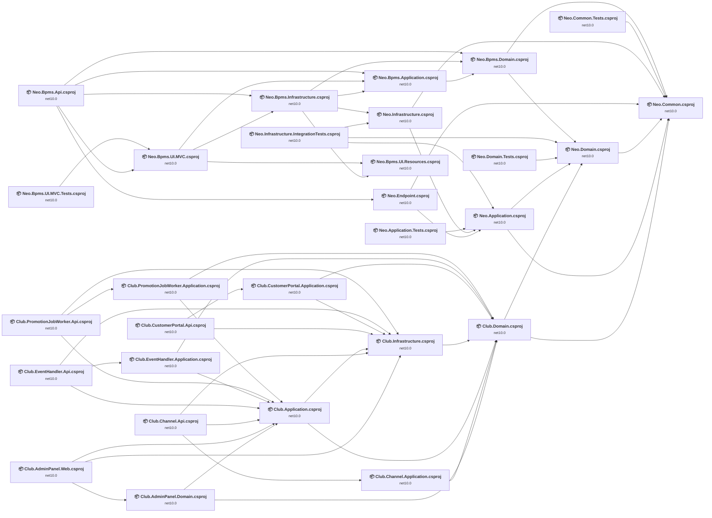

## Project Details

<a id="e:sjvsprojectsneosrcneoapplicationneoapplicationcsproj"></a>
### E:\SJVS\Projects\Neo\src\Neo.Application\Neo.Application.csproj

#### Project Info

- **Current Target Framework:** net10.0✅
- **SDK-style**: True
- **Project Kind:** ClassLibrary
- **Dependencies**: 2
- **Dependants**: 4
- **Number of Files**: 65
- **Lines of Code**: 2332
- **Estimated LOC to modify**: 0+ (at least 0/0% of the project)

#### Dependency Graph

Legend:
📦 SDK-style project
⚙️ Classic project

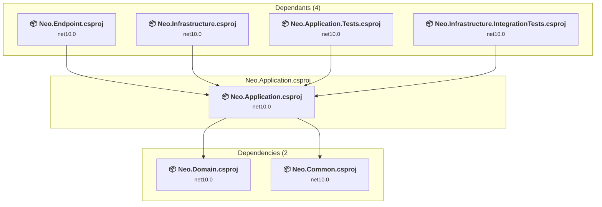

### API Compatibility

| Category | Count | Impact |
| :--- | :---: | :--- |
| 🔴 Binary Incompatible | 0 | High - Require code changes |
| 🟡 Source Incompatible | 0 | Medium - Needs re-compilation and potential conflicting API error fixing |
| 🔵 Behavioral change | 0 | Low - Behavioral changes that may require testing at runtime |
| ✅ Compatible | 0 |  |
| ***Total APIs Analyzed*** | ***0*** |  |

#### Project Package References

| Package | Type | Current Version | Suggested Version | Description |
| :--- | :---: | :---: | :---: | :--- |
| Ardalis.GuardClauses | Explicit | 5.0.0 |  | ✅Compatible |
| FluentValidation.DependencyInjectionExtensions | Explicit | 12.1.1 |  | ✅Compatible |
| Mapster | Explicit | 10.0.7 |  | ✅Compatible |
| Microsoft.SourceLink.GitHub | Explicit | 10.0.300 |  | ✅Compatible |

<a id="e:sjvsprojectsneosrcneocommonneocommoncsproj"></a>
### E:\SJVS\Projects\Neo\src\Neo.Common\Neo.Common.csproj

#### Project Info

- **Current Target Framework:** net10.0✅
- **SDK-style**: True
- **Project Kind:** ClassLibrary
- **Dependencies**: 0
- **Dependants**: 7
- **Number of Files**: 31
- **Lines of Code**: 2809
- **Estimated LOC to modify**: 0+ (at least 0/0% of the project)

#### Dependency Graph

Legend:
📦 SDK-style project
⚙️ Classic project

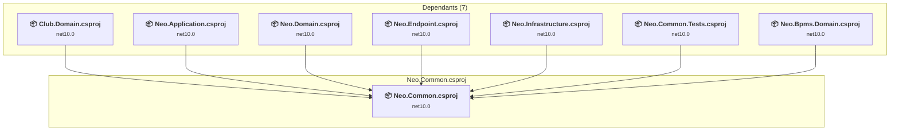

### API Compatibility

| Category | Count | Impact |
| :--- | :---: | :--- |
| 🔴 Binary Incompatible | 0 | High - Require code changes |
| 🟡 Source Incompatible | 0 | Medium - Needs re-compilation and potential conflicting API error fixing |
| 🔵 Behavioral change | 0 | Low - Behavioral changes that may require testing at runtime |
| ✅ Compatible | 0 |  |
| ***Total APIs Analyzed*** | ***0*** |  |

#### Project Package References

| Package | Type | Current Version | Suggested Version | Description |
| :--- | :---: | :---: | :---: | :--- |
| Microsoft.SourceLink.GitHub | Explicit | 10.0.300 |  | ✅Compatible |
| System.Drawing.Common | Explicit | 10.0.8 |  | ✅Compatible |

<a id="e:sjvsprojectsneosrcneodomainneodomaincsproj"></a>
### E:\SJVS\Projects\Neo\src\Neo.Domain\Neo.Domain.csproj

#### Project Info

- **Current Target Framework:** net10.0✅
- **SDK-style**: True
- **Project Kind:** ClassLibrary
- **Dependencies**: 1
- **Dependants**: 5
- **Number of Files**: 94
- **Lines of Code**: 2418
- **Estimated LOC to modify**: 0+ (at least 0/0% of the project)

#### Dependency Graph

Legend:
📦 SDK-style project
⚙️ Classic project

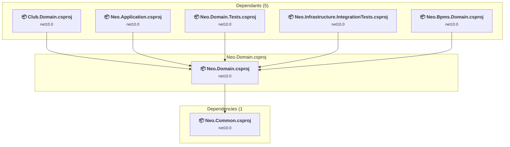

### API Compatibility

| Category | Count | Impact |
| :--- | :---: | :--- |
| 🔴 Binary Incompatible | 0 | High - Require code changes |
| 🟡 Source Incompatible | 0 | Medium - Needs re-compilation and potential conflicting API error fixing |
| 🔵 Behavioral change | 0 | Low - Behavioral changes that may require testing at runtime |
| ✅ Compatible | 0 |  |
| ***Total APIs Analyzed*** | ***0*** |  |

#### Project Package References

| Package | Type | Current Version | Suggested Version | Description |
| :--- | :---: | :---: | :---: | :--- |
| Castle.Core | Explicit | 5.2.1 |  | ✅Compatible |
| MediatR | Explicit | 14.1.0 |  | ✅Compatible |
| Microsoft.EntityFrameworkCore.Tools | Explicit | 10.0.8 |  | ✅Compatible |
| Microsoft.SourceLink.GitHub | Explicit | 10.0.300 |  | ✅Compatible |

<a id="e:sjvsprojectsneosrcneoendpointneoendpointcsproj"></a>
### E:\SJVS\Projects\Neo\src\Neo.Endpoint\Neo.Endpoint.csproj

#### Project Info

- **Current Target Framework:** net10.0✅
- **SDK-style**: True
- **Project Kind:** ClassLibrary
- **Dependencies**: 2
- **Dependants**: 1
- **Number of Files**: 39
- **Lines of Code**: 9651
- **Estimated LOC to modify**: 0+ (at least 0/0% of the project)

#### Dependency Graph

Legend:
📦 SDK-style project
⚙️ Classic project

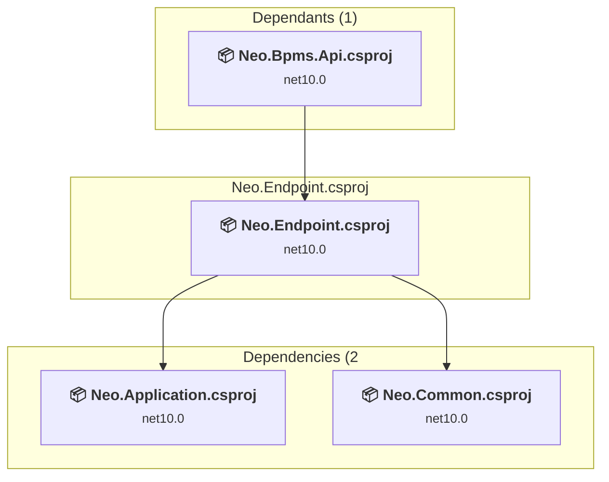

### API Compatibility

| Category | Count | Impact |
| :--- | :---: | :--- |
| 🔴 Binary Incompatible | 0 | High - Require code changes |
| 🟡 Source Incompatible | 0 | Medium - Needs re-compilation and potential conflicting API error fixing |
| 🔵 Behavioral change | 0 | Low - Behavioral changes that may require testing at runtime |
| ✅ Compatible | 0 |  |
| ***Total APIs Analyzed*** | ***0*** |  |

#### Project Package References

| Package | Type | Current Version | Suggested Version | Description |
| :--- | :---: | :---: | :---: | :--- |
| Asp.Versioning.Mvc | Explicit | 10.0.0 |  | ✅Compatible |
| Asp.Versioning.Mvc.ApiExplorer | Explicit | 10.0.0 |  | ✅Compatible |
| Microsoft.AspNetCore.Mvc.Razor.RuntimeCompilation | Explicit | 10.0.8 |  | ✅Compatible |
| Microsoft.SourceLink.GitHub | Explicit | 10.0.300 |  | ✅Compatible |
| NSwag.AspNetCore | Explicit | 14.7.1 |  | ✅Compatible |
| NSwag.MSBuild | Explicit | 14.7.1 |  | ✅Compatible |
| Serilog | Explicit | 4.3.1 |  | ✅Compatible |
| Serilog.Settings.Configuration | Explicit | 10.0.0 |  | ✅Compatible |
| Swashbuckle.AspNetCore.Annotations | Explicit | 10.1.7 |  | ✅Compatible |
| Swashbuckle.AspNetCore.SwaggerGen | Explicit | 10.1.7 |  | ✅Compatible |

<a id="e:sjvsprojectsneosrcneoinfrastructureneoinfrastructurecsproj"></a>
### E:\SJVS\Projects\Neo\src\Neo.Infrastructure\Neo.Infrastructure.csproj

#### Project Info

- **Current Target Framework:** net10.0✅
- **SDK-style**: True
- **Project Kind:** ClassLibrary
- **Dependencies**: 2
- **Dependants**: 2
- **Number of Files**: 64
- **Lines of Code**: 5356
- **Estimated LOC to modify**: 0+ (at least 0/0% of the project)

#### Dependency Graph

Legend:
📦 SDK-style project
⚙️ Classic project

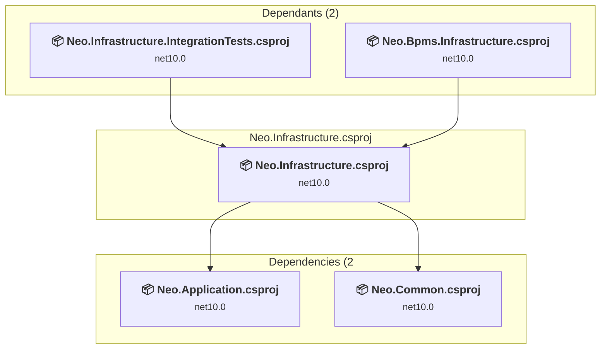

### API Compatibility

| Category | Count | Impact |
| :--- | :---: | :--- |
| 🔴 Binary Incompatible | 0 | High - Require code changes |
| 🟡 Source Incompatible | 0 | Medium - Needs re-compilation and potential conflicting API error fixing |
| 🔵 Behavioral change | 0 | Low - Behavioral changes that may require testing at runtime |
| ✅ Compatible | 0 |  |
| ***Total APIs Analyzed*** | ***0*** |  |

#### Project Package References

| Package | Type | Current Version | Suggested Version | Description |
| :--- | :---: | :---: | :---: | :--- |
| DNTPersianUtils.Core | Explicit | 6.9.0 |  | ✅Compatible |
| Hangfire | Explicit | 1.8.23 |  | ✅Compatible |
| Hangfire.Core | Explicit | 1.8.23 |  | ✅Compatible |
| Hangfire.Redis | Explicit | 2.0.1 |  | ✅Compatible |
| Hangfire.Redis.StackExchange | Explicit | 1.12.0 |  | ✅Compatible |
| Hangfire.SqlServer | Explicit | 1.8.23 |  | ✅Compatible |
| Microsoft.AspNetCore.Authentication.JwtBearer | Explicit | 10.0.8 |  | ✅Compatible |
| Microsoft.EntityFrameworkCore.SqlServer | Explicit | 10.0.8 |  | ✅Compatible |
| Microsoft.EntityFrameworkCore.Tools | Explicit | 10.0.8 |  | ✅Compatible |
| Microsoft.Extensions.Caching.StackExchangeRedis | Explicit | 10.0.8 |  | ✅Compatible |
| Microsoft.SourceLink.GitHub | Explicit | 10.0.300 |  | ✅Compatible |
| Minio | Explicit | 7.0.0 |  | ✅Compatible |
| MongoDB.Driver | Explicit | 3.8.1 |  | ✅Compatible |
| OpenTelemetry.Exporter.Console | Explicit | 1.15.3 |  | ✅Compatible |
| OpenTelemetry.Exporter.OpenTelemetryProtocol | Explicit | 1.15.3 |  | ✅Compatible |
| OpenTelemetry.Extensions.Hosting | Explicit | 1.15.3 |  | ✅Compatible |
| OpenTelemetry.Instrumentation.AspNetCore | Explicit | 1.15.2 |  | ✅Compatible |
| OpenTelemetry.Instrumentation.EntityFrameworkCore | Explicit | 1.12.0-beta.2 |  | ✅Compatible |
| OpenTelemetry.Instrumentation.Http | Explicit | 1.15.1 |  | ✅Compatible |
| OpenTelemetry.Instrumentation.Runtime | Explicit | 1.15.1 |  | ✅Compatible |
| OpenTelemetry.Instrumentation.SqlClient | Explicit | 1.15.2 |  | ✅Compatible |
| Otp.NET | Explicit | 1.4.1 |  | ✅Compatible |
| Serilog.AspNetCore | Explicit | 10.0.0 |  | ✅Compatible |

<a id="e:sjvsprojectsneotestsneoapplicationtestsneoapplicationtestscsproj"></a>
### E:\SJVS\Projects\Neo\tests\Neo.Application.Tests\Neo.Application.Tests.csproj

#### Project Info

- **Current Target Framework:** net10.0✅
- **SDK-style**: True
- **Project Kind:** ClassLibrary
- **Dependencies**: 1
- **Dependants**: 0
- **Number of Files**: 4
- **Lines of Code**: 218
- **Estimated LOC to modify**: 0+ (at least 0/0% of the project)

#### Dependency Graph

Legend:
📦 SDK-style project
⚙️ Classic project

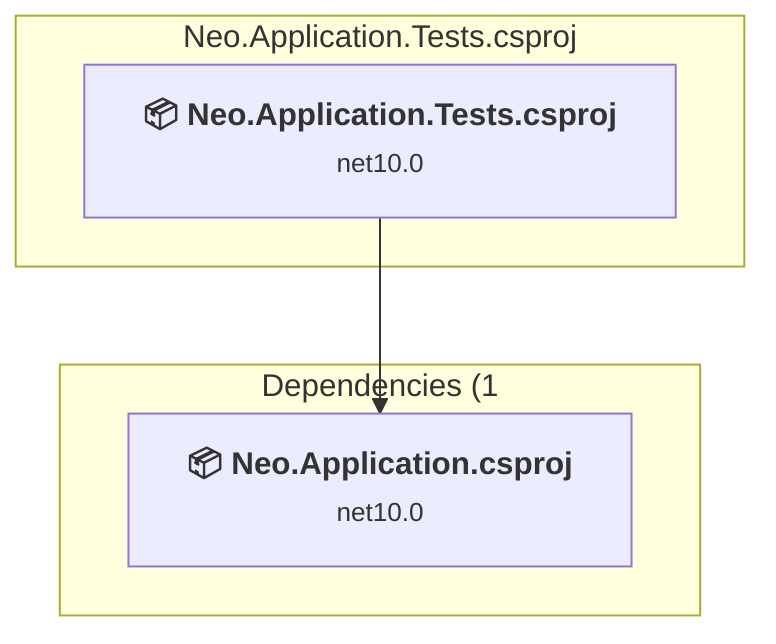

### API Compatibility

| Category | Count | Impact |
| :--- | :---: | :--- |
| 🔴 Binary Incompatible | 0 | High - Require code changes |
| 🟡 Source Incompatible | 0 | Medium - Needs re-compilation and potential conflicting API error fixing |
| 🔵 Behavioral change | 0 | Low - Behavioral changes that may require testing at runtime |
| ✅ Compatible | 0 |  |
| ***Total APIs Analyzed*** | ***0*** |  |

#### Project Package References

| Package | Type | Current Version | Suggested Version | Description |
| :--- | :---: | :---: | :---: | :--- |
| coverlet.collector | Explicit | 10.0.0 |  | ✅Compatible |
| FluentAssertions | Explicit | 8.10.0 |  | ✅Compatible |
| Microsoft.NET.Test.Sdk | Explicit | 18.5.1 |  | ✅Compatible |
| Microsoft.SourceLink.GitHub | Explicit | 10.0.300 |  | ✅Compatible |
| xunit.v3 | Explicit | 3.2.2 |  | ✅Compatible |

<a id="e:sjvsprojectsneotestsneocommontestsneocommontestscsproj"></a>
### E:\SJVS\Projects\Neo\tests\Neo.Common.Tests\Neo.Common.Tests.csproj

#### Project Info

- **Current Target Framework:** net10.0✅
- **SDK-style**: True
- **Project Kind:** ClassLibrary
- **Dependencies**: 1
- **Dependants**: 0
- **Number of Files**: 9
- **Lines of Code**: 1398
- **Estimated LOC to modify**: 0+ (at least 0/0% of the project)

#### Dependency Graph

Legend:
📦 SDK-style project
⚙️ Classic project

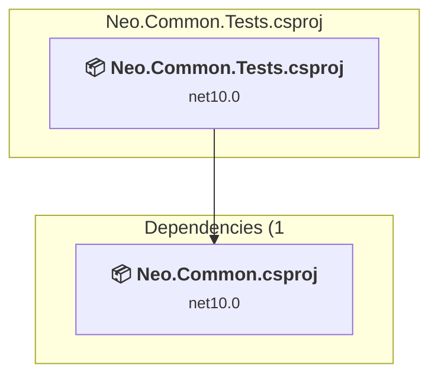

### API Compatibility

| Category | Count | Impact |
| :--- | :---: | :--- |
| 🔴 Binary Incompatible | 0 | High - Require code changes |
| 🟡 Source Incompatible | 0 | Medium - Needs re-compilation and potential conflicting API error fixing |
| 🔵 Behavioral change | 0 | Low - Behavioral changes that may require testing at runtime |
| ✅ Compatible | 0 |  |
| ***Total APIs Analyzed*** | ***0*** |  |

#### Project Package References

| Package | Type | Current Version | Suggested Version | Description |
| :--- | :---: | :---: | :---: | :--- |
| coverlet.collector | Explicit | 10.0.0 |  | ✅Compatible |
| FluentAssertions | Explicit | 8.10.0 |  | ✅Compatible |
| Microsoft.NET.Test.Sdk | Explicit | 18.5.1 |  | ✅Compatible |
| Microsoft.SourceLink.GitHub | Explicit | 10.0.300 |  | ✅Compatible |
| xunit.v3 | Explicit | 3.2.2 |  | ✅Compatible |

<a id="e:sjvsprojectsneotestsneodomaintestsneodomaintestscsproj"></a>
### E:\SJVS\Projects\Neo\tests\Neo.Domain.Tests\Neo.Domain.Tests.csproj

#### Project Info

- **Current Target Framework:** net10.0✅
- **SDK-style**: True
- **Project Kind:** ClassLibrary
- **Dependencies**: 1
- **Dependants**: 0
- **Number of Files**: 2
- **Lines of Code**: 167
- **Estimated LOC to modify**: 0+ (at least 0/0% of the project)

#### Dependency Graph

Legend:
📦 SDK-style project
⚙️ Classic project

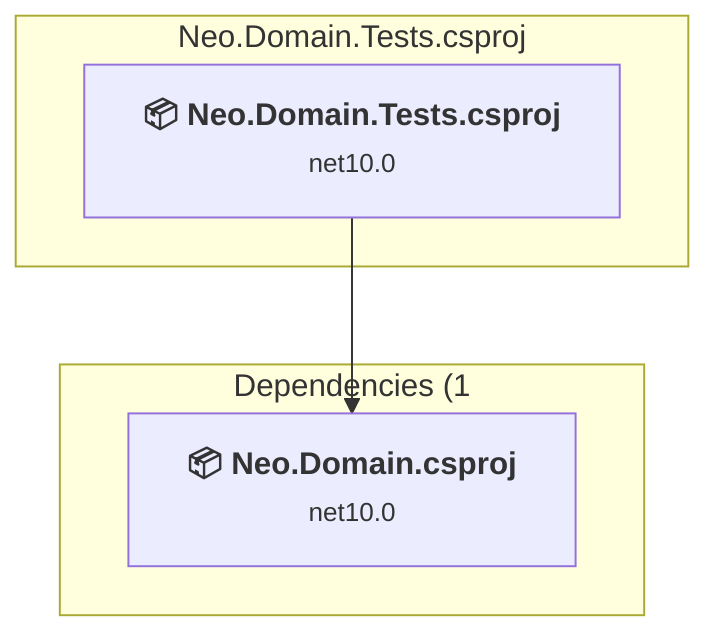

### API Compatibility

| Category | Count | Impact |
| :--- | :---: | :--- |
| 🔴 Binary Incompatible | 0 | High - Require code changes |
| 🟡 Source Incompatible | 0 | Medium - Needs re-compilation and potential conflicting API error fixing |
| 🔵 Behavioral change | 0 | Low - Behavioral changes that may require testing at runtime |
| ✅ Compatible | 0 |  |
| ***Total APIs Analyzed*** | ***0*** |  |

#### Project Package References

| Package | Type | Current Version | Suggested Version | Description |
| :--- | :---: | :---: | :---: | :--- |
| coverlet.collector | Explicit | 10.0.0 |  | ✅Compatible |
| FluentAssertions | Explicit | 8.10.0 |  | ✅Compatible |
| Microsoft.NET.Test.Sdk | Explicit | 18.5.1 |  | ✅Compatible |
| Microsoft.SourceLink.GitHub | Explicit | 10.0.300 |  | ✅Compatible |
| xunit.v3 | Explicit | 3.2.2 |  | ✅Compatible |

<a id="e:sjvsprojectsneotestsneoinfrastructureintegrationtestsneoinfrastructureintegrationtestscsproj"></a>
### E:\SJVS\Projects\Neo\tests\Neo.Infrastructure.IntegrationTests\Neo.Infrastructure.IntegrationTests.csproj

#### Project Info

- **Current Target Framework:** net10.0✅
- **SDK-style**: True
- **Project Kind:** ClassLibrary
- **Dependencies**: 3
- **Dependants**: 0
- **Number of Files**: 1
- **Lines of Code**: 230
- **Estimated LOC to modify**: 0+ (at least 0/0% of the project)

#### Dependency Graph

Legend:
📦 SDK-style project
⚙️ Classic project

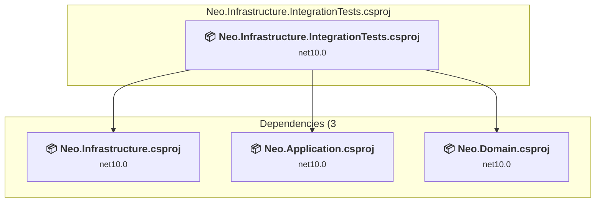

### API Compatibility

| Category | Count | Impact |
| :--- | :---: | :--- |
| 🔴 Binary Incompatible | 0 | High - Require code changes |
| 🟡 Source Incompatible | 0 | Medium - Needs re-compilation and potential conflicting API error fixing |
| 🔵 Behavioral change | 0 | Low - Behavioral changes that may require testing at runtime |
| ✅ Compatible | 0 |  |
| ***Total APIs Analyzed*** | ***0*** |  |

#### Project Package References

| Package | Type | Current Version | Suggested Version | Description |
| :--- | :---: | :---: | :---: | :--- |
| coverlet.collector | Explicit | 10.0.0 |  | ✅Compatible |
| FluentAssertions | Explicit | 8.10.0 |  | ✅Compatible |
| Microsoft.AspNetCore.Mvc.Testing | Explicit | 10.0.8 |  | ✅Compatible |
| Microsoft.EntityFrameworkCore.InMemory | Explicit | 10.0.8 |  | ✅Compatible |
| Microsoft.NET.Test.Sdk | Explicit | 18.5.1 |  | ✅Compatible |
| Microsoft.SourceLink.GitHub | Explicit | 10.0.300 |  | ✅Compatible |
| Moq | Explicit | 4.20.72 |  | ✅Compatible |
| xunit.v3 | Explicit | 3.2.2 |  | ✅Compatible |

<a id="e:sjvsprojectsneo-bpmssrcneobpmsapineobpmsapicsproj"></a>
### E:\SJVS\Projects\Neo-Bpms\src\Neo.Bpms.Api\Neo.Bpms.Api.csproj

#### Project Info

- **Current Target Framework:** net10.0✅
- **SDK-style**: True
- **Project Kind:** ClassLibrary
- **Dependencies**: 5
- **Dependants**: 0
- **Number of Files**: 25
- **Lines of Code**: 4110
- **Estimated LOC to modify**: 0+ (at least 0/0% of the project)

#### Dependency Graph

Legend:
📦 SDK-style project
⚙️ Classic project

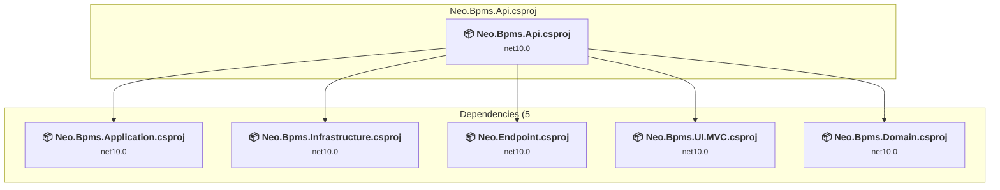

### API Compatibility

| Category | Count | Impact |
| :--- | :---: | :--- |
| 🔴 Binary Incompatible | 0 | High - Require code changes |
| 🟡 Source Incompatible | 0 | Medium - Needs re-compilation and potential conflicting API error fixing |
| 🔵 Behavioral change | 0 | Low - Behavioral changes that may require testing at runtime |
| ✅ Compatible | 0 |  |
| ***Total APIs Analyzed*** | ***0*** |  |

#### Project Package References

| Package | Type | Current Version | Suggested Version | Description |
| :--- | :---: | :---: | :---: | :--- |
| EPPlus | Explicit | 8.0.1 |  | ✅Compatible |
| Microsoft.AspNetCore.SignalR.Common | Explicit | 10.0.0 |  | ✅Compatible |
| Microsoft.Data.Sqlite | Explicit | 10.0.8 |  | ✅Compatible |
| MinVer | Explicit | 5.0.0 |  | ✅Compatible |
| Serilog | Explicit | 4.3.1 |  | ✅Compatible |
| Serilog.Settings.Configuration | Explicit | 10.0.0 |  | ✅Compatible |
| System.Diagnostics.DiagnosticSource | Explicit | 10.0.0 |  | ✅Compatible |

<a id="e:sjvsprojectsneo-bpmssrcneobpmsapplicationneobpmsapplicationcsproj"></a>
### E:\SJVS\Projects\Neo-Bpms\src\Neo.Bpms.Application\Neo.Bpms.Application.csproj

#### Project Info

- **Current Target Framework:** net10.0✅
- **SDK-style**: True
- **Project Kind:** ClassLibrary
- **Dependencies**: 1
- **Dependants**: 3
- **Number of Files**: 2
- **Lines of Code**: 7
- **Estimated LOC to modify**: 0+ (at least 0/0% of the project)

#### Dependency Graph

Legend:
📦 SDK-style project
⚙️ Classic project

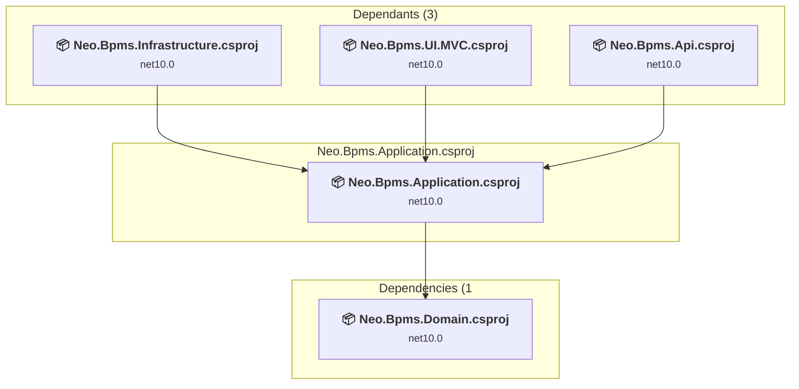

### API Compatibility

| Category | Count | Impact |
| :--- | :---: | :--- |
| 🔴 Binary Incompatible | 0 | High - Require code changes |
| 🟡 Source Incompatible | 0 | Medium - Needs re-compilation and potential conflicting API error fixing |
| 🔵 Behavioral change | 0 | Low - Behavioral changes that may require testing at runtime |
| ✅ Compatible | 0 |  |
| ***Total APIs Analyzed*** | ***0*** |  |

#### Project Package References

| Package | Type | Current Version | Suggested Version | Description |
| :--- | :---: | :---: | :---: | :--- |

<a id="e:sjvsprojectsneo-bpmssrcneobpmsdomainneobpmsdomaincsproj"></a>
### E:\SJVS\Projects\Neo-Bpms\src\Neo.Bpms.Domain\Neo.Bpms.Domain.csproj

#### Project Info

- **Current Target Framework:** net10.0✅
- **SDK-style**: True
- **Project Kind:** ClassLibrary
- **Dependencies**: 2
- **Dependants**: 3
- **Number of Files**: 870
- **Lines of Code**: 55226
- **Estimated LOC to modify**: 0+ (at least 0/0% of the project)

#### Dependency Graph

Legend:
📦 SDK-style project
⚙️ Classic project

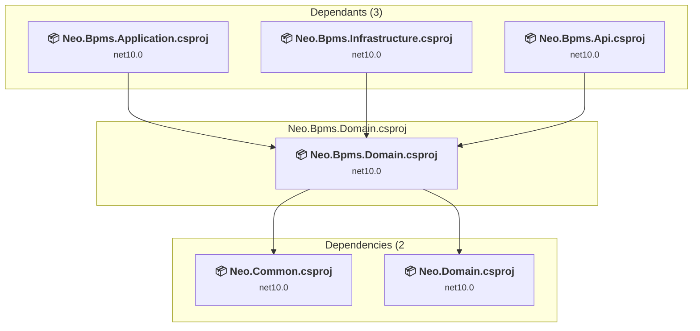

### API Compatibility

| Category | Count | Impact |
| :--- | :---: | :--- |
| 🔴 Binary Incompatible | 0 | High - Require code changes |
| 🟡 Source Incompatible | 0 | Medium - Needs re-compilation and potential conflicting API error fixing |
| 🔵 Behavioral change | 0 | Low - Behavioral changes that may require testing at runtime |
| ✅ Compatible | 0 |  |
| ***Total APIs Analyzed*** | ***0*** |  |

#### Project Package References

| Package | Type | Current Version | Suggested Version | Description |
| :--- | :---: | :---: | :---: | :--- |
| Microsoft.Extensions.Configuration.Abstractions | Explicit | 10.0.0 |  | ✅Compatible |
| Microsoft.Extensions.DependencyInjection.Abstractions | Explicit | 10.0.0 |  | ✅Compatible |
| Microsoft.Extensions.Logging.Abstractions | Explicit | 10.0.0 |  | ✅Compatible |

<a id="e:sjvsprojectsneo-bpmssrcneobpmsinfrastructureneobpmsinfrastructurecsproj"></a>
### E:\SJVS\Projects\Neo-Bpms\src\Neo.Bpms.Infrastructure\Neo.Bpms.Infrastructure.csproj

#### Project Info

- **Current Target Framework:** net10.0✅
- **SDK-style**: True
- **Project Kind:** ClassLibrary
- **Dependencies**: 4
- **Dependants**: 2
- **Number of Files**: 570
- **Lines of Code**: 57846
- **Estimated LOC to modify**: 0+ (at least 0/0% of the project)

#### Dependency Graph

Legend:
📦 SDK-style project
⚙️ Classic project

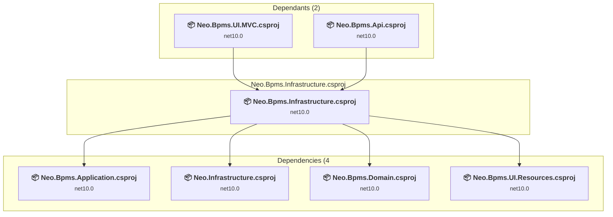

### API Compatibility

| Category | Count | Impact |
| :--- | :---: | :--- |
| 🔴 Binary Incompatible | 0 | High - Require code changes |
| 🟡 Source Incompatible | 0 | Medium - Needs re-compilation and potential conflicting API error fixing |
| 🔵 Behavioral change | 0 | Low - Behavioral changes that may require testing at runtime |
| ✅ Compatible | 0 |  |
| ***Total APIs Analyzed*** | ***0*** |  |

#### Project Package References

| Package | Type | Current Version | Suggested Version | Description |
| :--- | :---: | :---: | :---: | :--- |
| Ardalis.GuardClauses | Explicit | 5.0.0 |  | ✅Compatible |
| EPPlus | Explicit | 8.0.1 |  | ✅Compatible |
| MediatR | Explicit | 14.1.0 |  | ✅Compatible |
| Microsoft.AspNetCore.Html.Abstractions | Explicit | 2.3.10 |  | ✅Compatible |
| Microsoft.AspNetCore.Http.Abstractions | Explicit | 2.3.10 |  | ✅Compatible |
| Microsoft.EntityFrameworkCore | Explicit | 10.0.8 |  | ✅Compatible |
| Microsoft.EntityFrameworkCore.SqlServer | Explicit | 10.0.8 |  | ✅Compatible |
| Microsoft.OpenApi | Explicit | 1.6.22 |  | ✅Compatible |
| Microsoft.SqlServer.SqlManagementObjects | Explicit | 172.64.0 |  | ✅Compatible |
| RestSharp | Explicit | 112.1.0 |  | ✅Compatible |
| SharpZipLib | Explicit | 1.4.2 |  | ✅Compatible |
| System.Data.OracleClient | Explicit | 1.0.8 |  | ✅Compatible |
| System.Drawing.Common | Explicit | 10.0.8 |  | ✅Compatible |
| System.Formats.Asn1 | Explicit | 10.0.0 |  | ✅Compatible |
| System.Security.Cryptography.Pkcs | Explicit | 10.0.0 |  | ✅Compatible |

<a id="e:sjvsprojectsneo-bpmssrcneobpmsuimvcneobpmsuimvccsproj"></a>
### E:\SJVS\Projects\Neo-Bpms\src\Neo.Bpms.UI.MVC\Neo.Bpms.UI.MVC.csproj

#### Project Info

- **Current Target Framework:** net10.0✅
- **SDK-style**: True
- **Project Kind:** ClassLibrary
- **Dependencies**: 3
- **Dependants**: 2
- **Number of Files**: 448
- **Lines of Code**: 58202
- **Estimated LOC to modify**: 0+ (at least 0/0% of the project)

#### Dependency Graph

Legend:
📦 SDK-style project
⚙️ Classic project

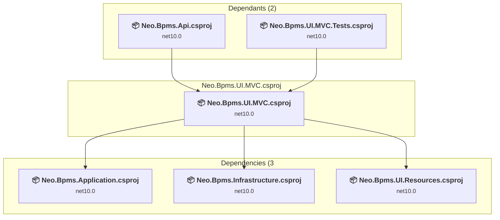

### API Compatibility

| Category | Count | Impact |
| :--- | :---: | :--- |
| 🔴 Binary Incompatible | 0 | High - Require code changes |
| 🟡 Source Incompatible | 0 | Medium - Needs re-compilation and potential conflicting API error fixing |
| 🔵 Behavioral change | 0 | Low - Behavioral changes that may require testing at runtime |
| ✅ Compatible | 0 |  |
| ***Total APIs Analyzed*** | ***0*** |  |

#### Project Package References

| Package | Type | Current Version | Suggested Version | Description |
| :--- | :---: | :---: | :---: | :--- |
| Ardalis.GuardClauses | Explicit | 5.0.0 |  | ✅Compatible |
| Asp.Versioning.Mvc | Explicit | 10.0.0 |  | ✅Compatible |
| Captcha | Explicit | 4.4.2 |  | ✅Compatible |
| DNTPersianUtils.Core | Explicit | 6.9.0 |  | ✅Compatible |
| EPPlus | Explicit | 8.0.1 |  | ✅Compatible |
| Markdig | Explicit | 0.42.0 |  | ✅Compatible |
| MediatR | Explicit | 14.1.0 |  | ✅Compatible |
| Microsoft.AspNetCore.Authentication.JwtBearer | Explicit | 10.0.8 |  | ✅Compatible |
| Microsoft.AspNetCore.Mvc.NewtonsoftJson | Explicit | 10.0.0 |  | ✅Compatible |
| Microsoft.OpenApi | Explicit | 1.6.22 |  | ✅Compatible |
| NWebsec.AspNetCore.Middleware | Explicit | 3.0.0 |  | ✅Compatible |
| System.Diagnostics.PerformanceCounter | Explicit | 10.0.0 |  | ✅Compatible |

<a id="e:sjvsprojectsneo-bpmssrcneobpmsuiresourcesneobpmsuiresourcescsproj"></a>
### E:\SJVS\Projects\Neo-Bpms\src\Neo.Bpms.UI.Resources\Neo.Bpms.UI.Resources.csproj

#### Project Info

- **Current Target Framework:** net10.0✅
- **SDK-style**: True
- **Project Kind:** ClassLibrary
- **Dependencies**: 0
- **Dependants**: 2
- **Number of Files**: 12
- **Lines of Code**: 5796
- **Estimated LOC to modify**: 0+ (at least 0/0% of the project)

#### Dependency Graph

Legend:
📦 SDK-style project
⚙️ Classic project

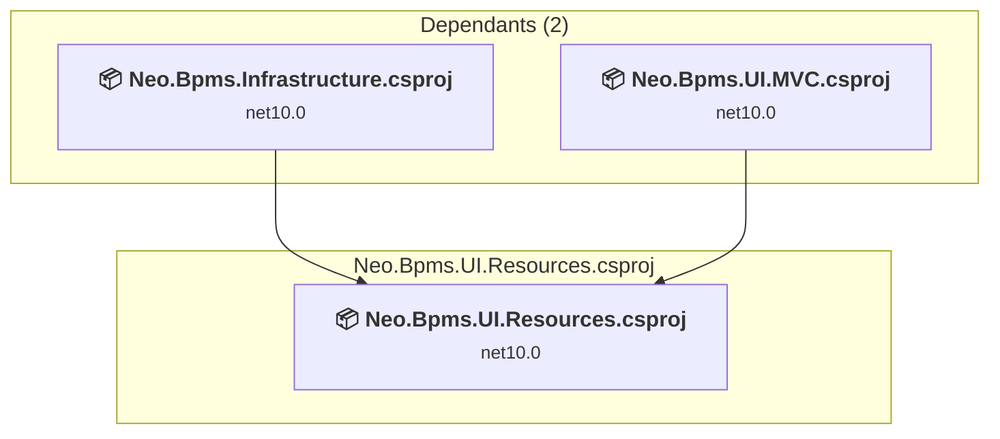

### API Compatibility

| Category | Count | Impact |
| :--- | :---: | :--- |
| 🔴 Binary Incompatible | 0 | High - Require code changes |
| 🟡 Source Incompatible | 0 | Medium - Needs re-compilation and potential conflicting API error fixing |
| 🔵 Behavioral change | 0 | Low - Behavioral changes that may require testing at runtime |
| ✅ Compatible | 0 |  |
| ***Total APIs Analyzed*** | ***0*** |  |

#### Project Package References

| Package | Type | Current Version | Suggested Version | Description |
| :--- | :---: | :---: | :---: | :--- |

<a id="e:sjvsprojectsneo-bpmstestsneobpmsuimvctestsneobpmsuimvctestscsproj"></a>
### E:\SJVS\Projects\Neo-Bpms\tests\Neo.Bpms.UI.MVC.Tests\Neo.Bpms.UI.MVC.Tests.csproj

#### Project Info

- **Current Target Framework:** net10.0✅
- **SDK-style**: True
- **Project Kind:** ClassLibrary
- **Dependencies**: 1
- **Dependants**: 0
- **Number of Files**: 7
- **Lines of Code**: 1319
- **Estimated LOC to modify**: 0+ (at least 0/0% of the project)

#### Dependency Graph

Legend:
📦 SDK-style project
⚙️ Classic project

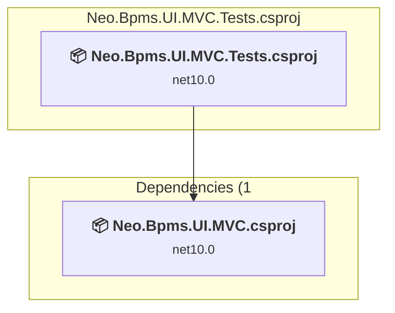

### API Compatibility

| Category | Count | Impact |
| :--- | :---: | :--- |
| 🔴 Binary Incompatible | 0 | High - Require code changes |
| 🟡 Source Incompatible | 0 | Medium - Needs re-compilation and potential conflicting API error fixing |
| 🔵 Behavioral change | 0 | Low - Behavioral changes that may require testing at runtime |
| ✅ Compatible | 0 |  |
| ***Total APIs Analyzed*** | ***0*** |  |

#### Project Package References

| Package | Type | Current Version | Suggested Version | Description |
| :--- | :---: | :---: | :---: | :--- |
| coverlet.collector | Explicit | 10.0.0 |  | ✅Compatible |
| FluentAssertions | Explicit | 8.10.0 |  | ✅Compatible |
| Microsoft.Data.Sqlite | Explicit | 10.0.8 |  | ✅Compatible |
| Microsoft.NET.Test.Sdk | Explicit | 18.5.1 |  | ✅Compatible |
| Moq | Explicit | 4.20.72 |  | ✅Compatible |
| xunit.v3 | Explicit | 3.2.2 |  | ✅Compatible |

<a id="srcadminpanelclubadminpaneldomainclubadminpaneldomaincsproj"></a>
### src\AdminPanel\Club.AdminPanel.Domain\Club.AdminPanel.Domain.csproj

#### Project Info

- **Current Target Framework:** net10.0
- **Proposed Target Framework:** net10.0
- **SDK-style**: True
- **Project Kind:** ClassLibrary
- **Dependencies**: 2
- **Dependants**: 1
- **Number of Files**: 76
- **Number of Files with Incidents**: 1
- **Lines of Code**: 6907
- **Estimated LOC to modify**: 0+ (at least 0/0% of the project)

#### Dependency Graph

Legend:
📦 SDK-style project
⚙️ Classic project

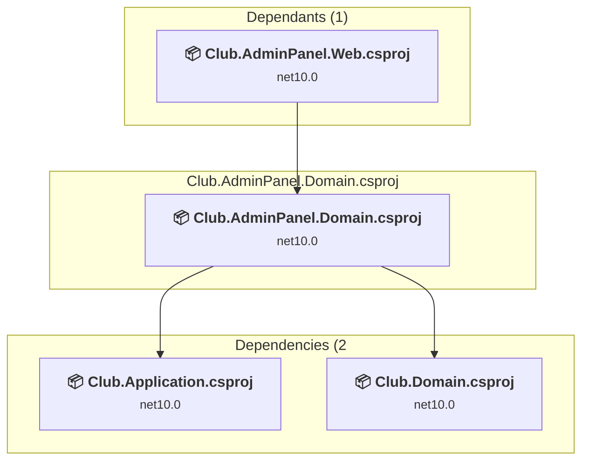

### API Compatibility

| Category | Count | Impact |
| :--- | :---: | :--- |
| 🔴 Binary Incompatible | 0 | High - Require code changes |
| 🟡 Source Incompatible | 0 | Medium - Needs re-compilation and potential conflicting API error fixing |
| 🔵 Behavioral change | 0 | Low - Behavioral changes that may require testing at runtime |
| ✅ Compatible | 197 |  |
| ***Total APIs Analyzed*** | ***197*** |  |

<a id="srcadminpanelclubadminpanelwebclubadminpanelwebcsproj"></a>
### src\AdminPanel\Club.AdminPanel.Web\Club.AdminPanel.Web.csproj

#### Project Info

- **Current Target Framework:** net10.0
- **Proposed Target Framework:** net10.0
- **SDK-style**: True
- **Project Kind:** AspNetCore
- **Dependencies**: 3
- **Dependants**: 0
- **Number of Files**: 1041
- **Number of Files with Incidents**: 6
- **Lines of Code**: 4646
- **Estimated LOC to modify**: 17+ (at least 0/4% of the project)

#### Dependency Graph

Legend:
📦 SDK-style project
⚙️ Classic project

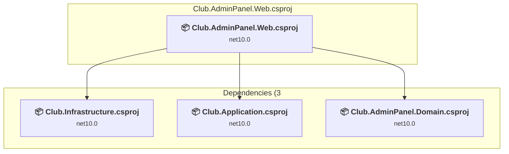

### API Compatibility

| Category | Count | Impact |
| :--- | :---: | :--- |
| 🔴 Binary Incompatible | 10 | High - Require code changes |
| 🟡 Source Incompatible | 7 | Medium - Needs re-compilation and potential conflicting API error fixing |
| 🔵 Behavioral change | 0 | Low - Behavioral changes that may require testing at runtime |
| ✅ Compatible | 2422 |  |
| ***Total APIs Analyzed*** | ***2439*** |  |

#### Project Technologies and Features

| Technology | Issues | Percentage | Migration Path |
| :--- | :---: | :---: | :--- |
| IdentityModel & Claims-based Security | 9 | 52/9% | Windows Identity Foundation (WIF), SAML, and claims-based authentication APIs that have been replaced by modern identity libraries. WIF was the original identity framework for .NET Framework. Migrate to Microsoft.IdentityModel.* packages (modern identity stack). |

<a id="srcchannelclubchannelapiclubchannelapicsproj"></a>
### src\Channel\Club.Channel.Api\Club.Channel.Api.csproj

#### Project Info

- **Current Target Framework:** net10.0
- **Proposed Target Framework:** net10.0
- **SDK-style**: True
- **Project Kind:** AspNetCore
- **Dependencies**: 3
- **Dependants**: 0
- **Number of Files**: 26
- **Number of Files with Incidents**: 3
- **Lines of Code**: 1121
- **Estimated LOC to modify**: 6+ (at least 0/5% of the project)

#### Dependency Graph

Legend:
📦 SDK-style project
⚙️ Classic project

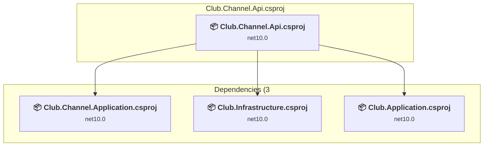

### API Compatibility

| Category | Count | Impact |
| :--- | :---: | :--- |
| 🔴 Binary Incompatible | 2 | High - Require code changes |
| 🟡 Source Incompatible | 2 | Medium - Needs re-compilation and potential conflicting API error fixing |
| 🔵 Behavioral change | 2 | Low - Behavioral changes that may require testing at runtime |
| ✅ Compatible | 1027 |  |
| ***Total APIs Analyzed*** | ***1033*** |  |

<a id="srcchannelclubchannelapplicationclubchannelapplicationcsproj"></a>
### src\Channel\Club.Channel.Application\Club.Channel.Application.csproj

#### Project Info

- **Current Target Framework:** net10.0
- **Proposed Target Framework:** net10.0
- **SDK-style**: True
- **Project Kind:** ClassLibrary
- **Dependencies**: 1
- **Dependants**: 1
- **Number of Files**: 5
- **Number of Files with Incidents**: 1
- **Lines of Code**: 300
- **Estimated LOC to modify**: 0+ (at least 0/0% of the project)

#### Dependency Graph

Legend:
📦 SDK-style project
⚙️ Classic project

```mermaid
flowchart TB
    subgraph upstream["Dependants (1)"]
        P3["<b>📦&nbsp;Club.Channel.Api.csproj</b><br/><small>net10.0</small>"]
        click P3 "#srcchannelclubchannelapiclubchannelapicsproj"
    end
    subgraph current["Club.Channel.Application.csproj"]
        MAIN["<b>📦&nbsp;Club.Channel.Application.csproj</b><br/><small>net10.0</small>"]
        click MAIN "#srcchannelclubchannelapplicationclubchannelapplicationcsproj"
    end
    subgraph downstream["Dependencies (1"]
        P6["<b>📦&nbsp;Club.Domain.csproj</b><br/><small>net10.0</small>"]
        click P6 "#srccoreclubdomainclubdomaincsproj"
    end
    P3 --> MAIN
    MAIN --> P6

```

### API Compatibility

| Category | Count | Impact |
| :--- | :---: | :--- |
| 🔴 Binary Incompatible | 0 | High - Require code changes |
| 🟡 Source Incompatible | 0 | Medium - Needs re-compilation and potential conflicting API error fixing |
| 🔵 Behavioral change | 0 | Low - Behavioral changes that may require testing at runtime |
| ✅ Compatible | 410 |  |
| ***Total APIs Analyzed*** | ***410*** |  |

<a id="srccoreclubapplicationclubapplicationcsproj"></a>
### src\Core\Club.Application\Club.Application.csproj

#### Project Info

- **Current Target Framework:** net10.0
- **Proposed Target Framework:** net10.0
- **SDK-style**: True
- **Project Kind:** ClassLibrary
- **Dependencies**: 2
- **Dependants**: 7
- **Number of Files**: 49
- **Number of Files with Incidents**: 1
- **Lines of Code**: 3069
- **Estimated LOC to modify**: 0+ (at least 0/0% of the project)

#### Dependency Graph

Legend:
📦 SDK-style project
⚙️ Classic project

```mermaid
flowchart TB
    subgraph upstream["Dependants (7)"]
        P1["<b>📦&nbsp;Club.AdminPanel.Domain.csproj</b><br/><small>net10.0</small>"]
        P2["<b>📦&nbsp;Club.AdminPanel.Web.csproj</b><br/><small>net10.0</small>"]
        P3["<b>📦&nbsp;Club.Channel.Api.csproj</b><br/><small>net10.0</small>"]
        P10["<b>📦&nbsp;Club.EventHandler.Api.csproj</b><br/><small>net10.0</small>"]
        P11["<b>📦&nbsp;Club.EventHandler.Application.csproj</b><br/><small>net10.0</small>"]
        P12["<b>📦&nbsp;Club.PromotionJobWorker.Api.csproj</b><br/><small>net10.0</small>"]
        P13["<b>📦&nbsp;Club.PromotionJobWorker.Application.csproj</b><br/><small>net10.0</small>"]
        click P1 "#srcadminpanelclubadminpaneldomainclubadminpaneldomaincsproj"
        click P2 "#srcadminpanelclubadminpanelwebclubadminpanelwebcsproj"
        click P3 "#srcchannelclubchannelapiclubchannelapicsproj"
        click P10 "#srceventhandlerclubeventhandlerapiclubeventhandlerapicsproj"
        click P11 "#srceventhandlerclubeventhandlerapplicationclubeventhandlerapplicationcsproj"
        click P12 "#srcpromotionjobworkerclubpromotionjobworkerapiclubpromotionjobworkerapicsproj"
        click P13 "#srcpromotionjobworkerclubpromotionjobworkerapplicationclubpromotionjobworkerapplicationcsproj"
    end
    subgraph current["Club.Application.csproj"]
        MAIN["<b>📦&nbsp;Club.Application.csproj</b><br/><small>net10.0</small>"]
        click MAIN "#srccoreclubapplicationclubapplicationcsproj"
    end
    subgraph downstream["Dependencies (2"]
        P6["<b>📦&nbsp;Club.Domain.csproj</b><br/><small>net10.0</small>"]
        P7["<b>📦&nbsp;Club.Infrastructure.csproj</b><br/><small>net10.0</small>"]
        click P6 "#srccoreclubdomainclubdomaincsproj"
        click P7 "#srccoreclubinfrastructureclubinfrastructurecsproj"
    end
    P1 --> MAIN
    P2 --> MAIN
    P3 --> MAIN
    P10 --> MAIN
    P11 --> MAIN
    P12 --> MAIN
    P13 --> MAIN
    MAIN --> P6
    MAIN --> P7

```

### API Compatibility

| Category | Count | Impact |
| :--- | :---: | :--- |
| 🔴 Binary Incompatible | 0 | High - Require code changes |
| 🟡 Source Incompatible | 0 | Medium - Needs re-compilation and potential conflicting API error fixing |
| 🔵 Behavioral change | 0 | Low - Behavioral changes that may require testing at runtime |
| ✅ Compatible | 3551 |  |
| ***Total APIs Analyzed*** | ***3551*** |  |

<a id="srccoreclubdomainclubdomaincsproj"></a>
### src\Core\Club.Domain\Club.Domain.csproj

#### Project Info

- **Current Target Framework:** net10.0
- **Proposed Target Framework:** net10.0
- **SDK-style**: True
- **Project Kind:** ClassLibrary
- **Dependencies**: 2
- **Dependants**: 7
- **Number of Files**: 128
- **Number of Files with Incidents**: 1
- **Lines of Code**: 10362
- **Estimated LOC to modify**: 0+ (at least 0/0% of the project)

#### Dependency Graph

Legend:
📦 SDK-style project
⚙️ Classic project

```mermaid
flowchart TB
    subgraph upstream["Dependants (7)"]
        P1["<b>📦&nbsp;Club.AdminPanel.Domain.csproj</b><br/><small>net10.0</small>"]
        P4["<b>📦&nbsp;Club.Channel.Application.csproj</b><br/><small>net10.0</small>"]
        P5["<b>📦&nbsp;Club.Application.csproj</b><br/><small>net10.0</small>"]
        P7["<b>📦&nbsp;Club.Infrastructure.csproj</b><br/><small>net10.0</small>"]
        P9["<b>📦&nbsp;Club.CustomerPortal.Application.csproj</b><br/><small>net10.0</small>"]
        P11["<b>📦&nbsp;Club.EventHandler.Application.csproj</b><br/><small>net10.0</small>"]
        P13["<b>📦&nbsp;Club.PromotionJobWorker.Application.csproj</b><br/><small>net10.0</small>"]
        click P1 "#srcadminpanelclubadminpaneldomainclubadminpaneldomaincsproj"
        click P4 "#srcchannelclubchannelapplicationclubchannelapplicationcsproj"
        click P5 "#srccoreclubapplicationclubapplicationcsproj"
        click P7 "#srccoreclubinfrastructureclubinfrastructurecsproj"
        click P9 "#srccustomerportalclubcustomerportalapplicationclubcustomerportalapplicationcsproj"
        click P11 "#srceventhandlerclubeventhandlerapplicationclubeventhandlerapplicationcsproj"
        click P13 "#srcpromotionjobworkerclubpromotionjobworkerapplicationclubpromotionjobworkerapplicationcsproj"
    end
    subgraph current["Club.Domain.csproj"]
        MAIN["<b>📦&nbsp;Club.Domain.csproj</b><br/><small>net10.0</small>"]
        click MAIN "#srccoreclubdomainclubdomaincsproj"
    end
    subgraph downstream["Dependencies (2"]
        P15["<b>📦&nbsp;Neo.Domain.csproj</b><br/><small>net10.0</small>"]
        P16["<b>📦&nbsp;Neo.Common.csproj</b><br/><small>net10.0</small>"]
        click P15 "#e:sjvsprojectsneosrcneodomainneodomaincsproj"
        click P16 "#e:sjvsprojectsneosrcneocommonneocommoncsproj"
    end
    P1 --> MAIN
    P4 --> MAIN
    P5 --> MAIN
    P7 --> MAIN
    P9 --> MAIN
    P11 --> MAIN
    P13 --> MAIN
    MAIN --> P15
    MAIN --> P16

```

### API Compatibility

| Category | Count | Impact |
| :--- | :---: | :--- |
| 🔴 Binary Incompatible | 0 | High - Require code changes |
| 🟡 Source Incompatible | 0 | Medium - Needs re-compilation and potential conflicting API error fixing |
| 🔵 Behavioral change | 0 | Low - Behavioral changes that may require testing at runtime |
| ✅ Compatible | 0 |  |
| ***Total APIs Analyzed*** | ***0*** |  |

<a id="srccoreclubinfrastructureclubinfrastructurecsproj"></a>
### src\Core\Club.Infrastructure\Club.Infrastructure.csproj

#### Project Info

- **Current Target Framework:** net10.0
- **Proposed Target Framework:** net10.0
- **SDK-style**: True
- **Project Kind:** ClassLibrary
- **Dependencies**: 1
- **Dependants**: 7
- **Number of Files**: 38
- **Number of Files with Incidents**: 3
- **Lines of Code**: 1377
- **Estimated LOC to modify**: 4+ (at least 0/3% of the project)

#### Dependency Graph

Legend:
📦 SDK-style project
⚙️ Classic project

```mermaid
flowchart TB
    subgraph upstream["Dependants (7)"]
        P2["<b>📦&nbsp;Club.AdminPanel.Web.csproj</b><br/><small>net10.0</small>"]
        P3["<b>📦&nbsp;Club.Channel.Api.csproj</b><br/><small>net10.0</small>"]
        P5["<b>📦&nbsp;Club.Application.csproj</b><br/><small>net10.0</small>"]
        P8["<b>📦&nbsp;Club.CustomerPortal.Api.csproj</b><br/><small>net10.0</small>"]
        P9["<b>📦&nbsp;Club.CustomerPortal.Application.csproj</b><br/><small>net10.0</small>"]
        P10["<b>📦&nbsp;Club.EventHandler.Api.csproj</b><br/><small>net10.0</small>"]
        P12["<b>📦&nbsp;Club.PromotionJobWorker.Api.csproj</b><br/><small>net10.0</small>"]
        click P2 "#srcadminpanelclubadminpanelwebclubadminpanelwebcsproj"
        click P3 "#srcchannelclubchannelapiclubchannelapicsproj"
        click P5 "#srccoreclubapplicationclubapplicationcsproj"
        click P8 "#srccustomerportalclubcustomerportalapiclubcustomerportalapicsproj"
        click P9 "#srccustomerportalclubcustomerportalapplicationclubcustomerportalapplicationcsproj"
        click P10 "#srceventhandlerclubeventhandlerapiclubeventhandlerapicsproj"
        click P12 "#srcpromotionjobworkerclubpromotionjobworkerapiclubpromotionjobworkerapicsproj"
    end
    subgraph current["Club.Infrastructure.csproj"]
        MAIN["<b>📦&nbsp;Club.Infrastructure.csproj</b><br/><small>net10.0</small>"]
        click MAIN "#srccoreclubinfrastructureclubinfrastructurecsproj"
    end
    subgraph downstream["Dependencies (1"]
        P6["<b>📦&nbsp;Club.Domain.csproj</b><br/><small>net10.0</small>"]
        click P6 "#srccoreclubdomainclubdomaincsproj"
    end
    P2 --> MAIN
    P3 --> MAIN
    P5 --> MAIN
    P8 --> MAIN
    P9 --> MAIN
    P10 --> MAIN
    P12 --> MAIN
    MAIN --> P6

```

### API Compatibility

| Category | Count | Impact |
| :--- | :---: | :--- |
| 🔴 Binary Incompatible | 0 | High - Require code changes |
| 🟡 Source Incompatible | 0 | Medium - Needs re-compilation and potential conflicting API error fixing |
| 🔵 Behavioral change | 4 | Low - Behavioral changes that may require testing at runtime |
| ✅ Compatible | 731 |  |
| ***Total APIs Analyzed*** | ***735*** |  |

<a id="srccustomerportalclubcustomerportalapiclubcustomerportalapicsproj"></a>
### src\CustomerPortal\Club.CustomerPortal.Api\Club.CustomerPortal.Api.csproj

#### Project Info

- **Current Target Framework:** net10.0
- **Proposed Target Framework:** net10.0
- **SDK-style**: True
- **Project Kind:** AspNetCore
- **Dependencies**: 2
- **Dependants**: 0
- **Number of Files**: 16
- **Number of Files with Incidents**: 3
- **Lines of Code**: 898
- **Estimated LOC to modify**: 5+ (at least 0/6% of the project)

#### Dependency Graph

Legend:
📦 SDK-style project
⚙️ Classic project

```mermaid
flowchart TB
    subgraph current["Club.CustomerPortal.Api.csproj"]
        MAIN["<b>📦&nbsp;Club.CustomerPortal.Api.csproj</b><br/><small>net10.0</small>"]
        click MAIN "#srccustomerportalclubcustomerportalapiclubcustomerportalapicsproj"
    end
    subgraph downstream["Dependencies (2"]
        P7["<b>📦&nbsp;Club.Infrastructure.csproj</b><br/><small>net10.0</small>"]
        P9["<b>📦&nbsp;Club.CustomerPortal.Application.csproj</b><br/><small>net10.0</small>"]
        click P7 "#srccoreclubinfrastructureclubinfrastructurecsproj"
        click P9 "#srccustomerportalclubcustomerportalapplicationclubcustomerportalapplicationcsproj"
    end
    MAIN --> P7
    MAIN --> P9

```

### API Compatibility

| Category | Count | Impact |
| :--- | :---: | :--- |
| 🔴 Binary Incompatible | 1 | High - Require code changes |
| 🟡 Source Incompatible | 2 | Medium - Needs re-compilation and potential conflicting API error fixing |
| 🔵 Behavioral change | 2 | Low - Behavioral changes that may require testing at runtime |
| ✅ Compatible | 824 |  |
| ***Total APIs Analyzed*** | ***829*** |  |

<a id="srccustomerportalclubcustomerportalapplicationclubcustomerportalapplicationcsproj"></a>
### src\CustomerPortal\Club.CustomerPortal.Application\Club.CustomerPortal.Application.csproj

#### Project Info

- **Current Target Framework:** net10.0
- **Proposed Target Framework:** net10.0
- **SDK-style**: True
- **Project Kind:** ClassLibrary
- **Dependencies**: 2
- **Dependants**: 1
- **Number of Files**: 72
- **Number of Files with Incidents**: 2
- **Lines of Code**: 4331
- **Estimated LOC to modify**: 4+ (at least 0/1% of the project)

#### Dependency Graph

Legend:
📦 SDK-style project
⚙️ Classic project

```mermaid
flowchart TB
    subgraph upstream["Dependants (1)"]
        P8["<b>📦&nbsp;Club.CustomerPortal.Api.csproj</b><br/><small>net10.0</small>"]
        click P8 "#srccustomerportalclubcustomerportalapiclubcustomerportalapicsproj"
    end
    subgraph current["Club.CustomerPortal.Application.csproj"]
        MAIN["<b>📦&nbsp;Club.CustomerPortal.Application.csproj</b><br/><small>net10.0</small>"]
        click MAIN "#srccustomerportalclubcustomerportalapplicationclubcustomerportalapplicationcsproj"
    end
    subgraph downstream["Dependencies (2"]
        P7["<b>📦&nbsp;Club.Infrastructure.csproj</b><br/><small>net10.0</small>"]
        P6["<b>📦&nbsp;Club.Domain.csproj</b><br/><small>net10.0</small>"]
        click P7 "#srccoreclubinfrastructureclubinfrastructurecsproj"
        click P6 "#srccoreclubdomainclubdomaincsproj"
    end
    P8 --> MAIN
    MAIN --> P7
    MAIN --> P6

```

### API Compatibility

| Category | Count | Impact |
| :--- | :---: | :--- |
| 🔴 Binary Incompatible | 4 | High - Require code changes |
| 🟡 Source Incompatible | 0 | Medium - Needs re-compilation and potential conflicting API error fixing |
| 🔵 Behavioral change | 0 | Low - Behavioral changes that may require testing at runtime |
| ✅ Compatible | 6237 |  |
| ***Total APIs Analyzed*** | ***6241*** |  |

#### Project Technologies and Features

| Technology | Issues | Percentage | Migration Path |
| :--- | :---: | :---: | :--- |
| IdentityModel & Claims-based Security | 4 | 100/0% | Windows Identity Foundation (WIF), SAML, and claims-based authentication APIs that have been replaced by modern identity libraries. WIF was the original identity framework for .NET Framework. Migrate to Microsoft.IdentityModel.* packages (modern identity stack). |

<a id="srceventhandlerclubeventhandlerapiclubeventhandlerapicsproj"></a>
### src\EventHandler\Club.EventHandler.Api\Club.EventHandler.Api.csproj

#### Project Info

- **Current Target Framework:** net10.0
- **Proposed Target Framework:** net10.0
- **SDK-style**: True
- **Project Kind:** AspNetCore
- **Dependencies**: 3
- **Dependants**: 0
- **Number of Files**: 2
- **Number of Files with Incidents**: 1
- **Lines of Code**: 44
- **Estimated LOC to modify**: 0+ (at least 0/0% of the project)

#### Dependency Graph

Legend:
📦 SDK-style project
⚙️ Classic project

```mermaid
flowchart TB
    subgraph current["Club.EventHandler.Api.csproj"]
        MAIN["<b>📦&nbsp;Club.EventHandler.Api.csproj</b><br/><small>net10.0</small>"]
        click MAIN "#srceventhandlerclubeventhandlerapiclubeventhandlerapicsproj"
    end
    subgraph downstream["Dependencies (3"]
        P7["<b>📦&nbsp;Club.Infrastructure.csproj</b><br/><small>net10.0</small>"]
        P5["<b>📦&nbsp;Club.Application.csproj</b><br/><small>net10.0</small>"]
        P11["<b>📦&nbsp;Club.EventHandler.Application.csproj</b><br/><small>net10.0</small>"]
        click P7 "#srccoreclubinfrastructureclubinfrastructurecsproj"
        click P5 "#srccoreclubapplicationclubapplicationcsproj"
        click P11 "#srceventhandlerclubeventhandlerapplicationclubeventhandlerapplicationcsproj"
    end
    MAIN --> P7
    MAIN --> P5
    MAIN --> P11

```

### API Compatibility

| Category | Count | Impact |
| :--- | :---: | :--- |
| 🔴 Binary Incompatible | 0 | High - Require code changes |
| 🟡 Source Incompatible | 0 | Medium - Needs re-compilation and potential conflicting API error fixing |
| 🔵 Behavioral change | 0 | Low - Behavioral changes that may require testing at runtime |
| ✅ Compatible | 105 |  |
| ***Total APIs Analyzed*** | ***105*** |  |

<a id="srceventhandlerclubeventhandlerapplicationclubeventhandlerapplicationcsproj"></a>
### src\EventHandler\Club.EventHandler.Application\Club.EventHandler.Application.csproj

#### Project Info

- **Current Target Framework:** net10.0
- **Proposed Target Framework:** net10.0
- **SDK-style**: True
- **Project Kind:** ClassLibrary
- **Dependencies**: 2
- **Dependants**: 1
- **Number of Files**: 1
- **Number of Files with Incidents**: 1
- **Lines of Code**: 6
- **Estimated LOC to modify**: 0+ (at least 0/0% of the project)

#### Dependency Graph

Legend:
📦 SDK-style project
⚙️ Classic project

```mermaid
flowchart TB
    subgraph upstream["Dependants (1)"]
        P10["<b>📦&nbsp;Club.EventHandler.Api.csproj</b><br/><small>net10.0</small>"]
        click P10 "#srceventhandlerclubeventhandlerapiclubeventhandlerapicsproj"
    end
    subgraph current["Club.EventHandler.Application.csproj"]
        MAIN["<b>📦&nbsp;Club.EventHandler.Application.csproj</b><br/><small>net10.0</small>"]
        click MAIN "#srceventhandlerclubeventhandlerapplicationclubeventhandlerapplicationcsproj"
    end
    subgraph downstream["Dependencies (2"]
        P5["<b>📦&nbsp;Club.Application.csproj</b><br/><small>net10.0</small>"]
        P6["<b>📦&nbsp;Club.Domain.csproj</b><br/><small>net10.0</small>"]
        click P5 "#srccoreclubapplicationclubapplicationcsproj"
        click P6 "#srccoreclubdomainclubdomaincsproj"
    end
    P10 --> MAIN
    MAIN --> P5
    MAIN --> P6

```

### API Compatibility

| Category | Count | Impact |
| :--- | :---: | :--- |
| 🔴 Binary Incompatible | 0 | High - Require code changes |
| 🟡 Source Incompatible | 0 | Medium - Needs re-compilation and potential conflicting API error fixing |
| 🔵 Behavioral change | 0 | Low - Behavioral changes that may require testing at runtime |
| ✅ Compatible | 0 |  |
| ***Total APIs Analyzed*** | ***0*** |  |

<a id="srcpromotionjobworkerclubpromotionjobworkerapiclubpromotionjobworkerapicsproj"></a>
### src\PromotionJobWorker\Club.PromotionJobWorker.Api\Club.PromotionJobWorker.Api.csproj

#### Project Info

- **Current Target Framework:** net10.0
- **Proposed Target Framework:** net10.0
- **SDK-style**: True
- **Project Kind:** AspNetCore
- **Dependencies**: 3
- **Dependants**: 0
- **Number of Files**: 2
- **Number of Files with Incidents**: 1
- **Lines of Code**: 44
- **Estimated LOC to modify**: 0+ (at least 0/0% of the project)

#### Dependency Graph

Legend:
📦 SDK-style project
⚙️ Classic project

```mermaid
flowchart TB
    subgraph current["Club.PromotionJobWorker.Api.csproj"]
        MAIN["<b>📦&nbsp;Club.PromotionJobWorker.Api.csproj</b><br/><small>net10.0</small>"]
        click MAIN "#srcpromotionjobworkerclubpromotionjobworkerapiclubpromotionjobworkerapicsproj"
    end
    subgraph downstream["Dependencies (3"]
        P7["<b>📦&nbsp;Club.Infrastructure.csproj</b><br/><small>net10.0</small>"]
        P5["<b>📦&nbsp;Club.Application.csproj</b><br/><small>net10.0</small>"]
        P13["<b>📦&nbsp;Club.PromotionJobWorker.Application.csproj</b><br/><small>net10.0</small>"]
        click P7 "#srccoreclubinfrastructureclubinfrastructurecsproj"
        click P5 "#srccoreclubapplicationclubapplicationcsproj"
        click P13 "#srcpromotionjobworkerclubpromotionjobworkerapplicationclubpromotionjobworkerapplicationcsproj"
    end
    MAIN --> P7
    MAIN --> P5
    MAIN --> P13

```

### API Compatibility

| Category | Count | Impact |
| :--- | :---: | :--- |
| 🔴 Binary Incompatible | 0 | High - Require code changes |
| 🟡 Source Incompatible | 0 | Medium - Needs re-compilation and potential conflicting API error fixing |
| 🔵 Behavioral change | 0 | Low - Behavioral changes that may require testing at runtime |
| ✅ Compatible | 105 |  |
| ***Total APIs Analyzed*** | ***105*** |  |

<a id="srcpromotionjobworkerclubpromotionjobworkerapplicationclubpromotionjobworkerapplicationcsproj"></a>
### src\PromotionJobWorker\Club.PromotionJobWorker.Application\Club.PromotionJobWorker.Application.csproj

#### Project Info

- **Current Target Framework:** net10.0
- **Proposed Target Framework:** net10.0
- **SDK-style**: True
- **Project Kind:** ClassLibrary
- **Dependencies**: 2
- **Dependants**: 1
- **Number of Files**: 1
- **Number of Files with Incidents**: 1
- **Lines of Code**: 6
- **Estimated LOC to modify**: 0+ (at least 0/0% of the project)

#### Dependency Graph

Legend:
📦 SDK-style project
⚙️ Classic project

```mermaid
flowchart TB
    subgraph upstream["Dependants (1)"]
        P12["<b>📦&nbsp;Club.PromotionJobWorker.Api.csproj</b><br/><small>net10.0</small>"]
        click P12 "#srcpromotionjobworkerclubpromotionjobworkerapiclubpromotionjobworkerapicsproj"
    end
    subgraph current["Club.PromotionJobWorker.Application.csproj"]
        MAIN["<b>📦&nbsp;Club.PromotionJobWorker.Application.csproj</b><br/><small>net10.0</small>"]
        click MAIN "#srcpromotionjobworkerclubpromotionjobworkerapplicationclubpromotionjobworkerapplicationcsproj"
    end
    subgraph downstream["Dependencies (2"]
        P5["<b>📦&nbsp;Club.Application.csproj</b><br/><small>net10.0</small>"]
        P6["<b>📦&nbsp;Club.Domain.csproj</b><br/><small>net10.0</small>"]
        click P5 "#srccoreclubapplicationclubapplicationcsproj"
        click P6 "#srccoreclubdomainclubdomaincsproj"
    end
    P12 --> MAIN
    MAIN --> P5
    MAIN --> P6

```

### API Compatibility

| Category | Count | Impact |
| :--- | :---: | :--- |
| 🔴 Binary Incompatible | 0 | High - Require code changes |
| 🟡 Source Incompatible | 0 | Medium - Needs re-compilation and potential conflicting API error fixing |
| 🔵 Behavioral change | 0 | Low - Behavioral changes that may require testing at runtime |
| ✅ Compatible | 0 |  |
| ***Total APIs Analyzed*** | ***0*** |  |

